# VPC Module Documentation

> **File**: `src/vpc/index.ts`  
> **Purpose**: Creates the foundational network infrastructure for all AWS resources

---

## Table of Contents

1. [Overview](#overview)
2. [Architecture Diagram](#architecture-diagram)
3. [Code Walkthrough](#code-walkthrough)
4. [Design Decisions](#design-decisions)
5. [Configuration Options](#configuration-options)
6. [Cost Implications](#cost-implications)

---

## Overview

The VPC (Virtual Private Cloud) module creates an isolated network environment in AWS that contains all infrastructure components. It implements a multi-AZ architecture with public and private subnets, configurable NAT gateways, and VPC Flow Logs for security monitoring.

### What This Module Creates

| Resource | Count | Purpose |
|----------|-------|---------|
| VPC | 1 | Isolated network (10.0.0.0/16) |
| Public Subnets | 1 per AZ | ALB, NAT Gateways |
| Private Subnets | 1 per AZ | ECS, RDS, Redis |
| Internet Gateway | 1 | Public internet access |
| NAT Gateways | 0-N (configurable) | Outbound internet for private subnets |
| Route Tables | 1 public + N private | Traffic routing |
| VPC Flow Logs | 1 | Network traffic logging |
| S3 VPC Endpoint | 1 | Free S3 access without NAT |

---

## Architecture Diagram

```mermaid
flowchart TB
    subgraph VPC["🌐 VPC (10.0.0.0/16)"]
        subgraph Public["Public Subnets"]
            subgraph AZ1P["AZ-a"]
                PS1[10.0.0.0/24]
                ALB1[⚖️ ALB]
                NAT1[🔄 NAT Gateway]
            end
            subgraph AZ2P["AZ-b"]
                PS2[10.0.1.0/24]
                ALB2[⚖️ ALB]
                NAT2[🔄 NAT Gateway]
            end
            subgraph AZ3P["AZ-c"]
                PS3[10.0.2.0/24]
                ALB3[⚖️ ALB]
            end
        end

        IGW[🌍 Internet Gateway]

        subgraph Private["Private Subnets"]
            subgraph AZ1["AZ-a"]
                PV1[10.0.100.0/24]
                ECS1[🔷 ECS Tasks]
                RDS1[(🐘 RDS Primary)]
            end
            subgraph AZ2["AZ-b"]
                PV2[10.0.101.0/24]
                ECS2[🔷 ECS Tasks]
                Redis1[(⚡ Redis)]
            end
            subgraph AZ3["AZ-c"]
                PV3[10.0.102.0/24]
                ECS3[🔷 ECS Tasks]
            end
        end

        S3EP[📦 S3 VPC Endpoint]
    end

    Internet((☁️ Internet)) <--> IGW
    IGW <--> Public
    NAT1 --> Private
    NAT2 --> Private
```



### Network Flow Diagram

```mermaid
flowchart LR
    subgraph Inbound["Inbound Traffic"]
        User([👤 User]) --> IGW
        IGW --> ALB
        ALB --> ECS[🔷 ECS in Private]
    end

    subgraph Outbound["Outbound Traffic"]
        ECS2[🔷 ECS] --> NAT[🔄 NAT Gateway]
        NAT --> IGW2[🌍 IGW]
        IGW2 --> ExtAPI([📡 External APIs])
    end

    subgraph Internal["Internal Only"]
        ECS3[🔷 ECS] --> S3EP[📦 S3 Endpoint]
        S3EP --> S3[(🪣 S3)]
    end
```



---

## Code Walkthrough

### 1. Imports and Interface

```typescript
import * as aws from "@pulumi/aws";
import * as pulumi from "@pulumi/pulumi";
import { Config, getTags } from "../../config";
```

**Why these imports:**
- `@pulumi/aws`: AWS provider for creating resources
- `@pulumi/pulumi`: Core Pulumi SDK for interpolation and outputs
- `Config, getTags`: Centralized configuration and consistent tagging

```typescript
export interface VpcOutputs {
  vpc: aws.ec2.Vpc;
  publicSubnets: aws.ec2.Subnet[];
  privateSubnets: aws.ec2.Subnet[];
  natGateways: aws.ec2.NatGateway[];
  internetGateway: aws.ec2.InternetGateway;
  publicRouteTable: aws.ec2.RouteTable;
  privateRouteTables: aws.ec2.RouteTable[];
}
```

**Why this interface:**
- TypeScript ensures downstream modules receive correct types
- Other modules need these references (security groups need VPC ID, ECS needs subnet IDs)
- Explicit exports make dependencies clear

---

### 2. VPC CIDR Block

```typescript
const VPC_CIDR = "10.0.0.0/16";
```

**Why 10.0.0.0/16:**
- **Private IP range**: 10.x.x.x is RFC 1918 private address space
- **/16 gives 65,536 IPs**: More than enough for any scale
- **Hardcoded intentionally**: Subnet calculations below depend on this structure
- **No overlap risk**: If you need VPC peering later, choose different CIDR for other VPCs

**Subnet allocation strategy:**
- Public: `10.0.0.0/24`, `10.0.1.0/24`, `10.0.2.0/24` (256 IPs each)
- Private: `10.0.100.0/24`, `10.0.101.0/24`, `10.0.102.0/24` (256 IPs each)
- Gap between 2 and 100 allows future expansion (e.g., database subnets at 10.0.50.x)

---

### 3. VPC Creation

```typescript
const vpc = new aws.ec2.Vpc(`${baseName}-vpc`, {
  cidrBlock: VPC_CIDR,
  enableDnsHostnames: true,
  enableDnsSupport: true,
  tags: { ... },
});
```

**Why enableDnsHostnames: true:**
- Allows EC2 instances and ECS tasks to receive public DNS hostnames
- Required for RDS to provide readable endpoints like `mydb.xxxx.us-east-1.rds.amazonaws.com`

**Why enableDnsSupport: true:**
- Enables the Amazon-provided DNS server at 10.0.0.2
- Required for VPC endpoints to work (ECR, S3, Secrets Manager)
- Without this, containers can't resolve AWS service endpoints

---

### 4. VPC Flow Logs

```typescript
const flowLogGroup = new aws.cloudwatch.LogGroup(`${baseName}-vpc-flow-logs`, {
  name: `/vpc/${baseName}/flow-logs`,
  retentionInDays: config.environment === "prod" ? 30 : 7,
  tags: { ... },
});
```

**Why VPC Flow Logs:**
- **Security**: Detect unusual traffic patterns, potential breaches
- **Troubleshooting**: Debug connectivity issues ("why can't my ECS task reach RDS?")
- **Compliance**: Many compliance frameworks (SOC2, HIPAA) require network logging
- **Cost optimization**: Identify unexpected data transfer

**Why different retention (30 vs 7 days):**
- Prod: Need longer retention for security investigations
- Dev: Short retention saves costs, dev issues are usually caught quickly

```typescript
const flowLogRole = new aws.iam.Role(`${baseName}-vpc-flow-log-role`, {
  assumeRolePolicy: JSON.stringify({
    Version: "2012-10-17",
    Statement: [{
      Effect: "Allow",
      Principal: { Service: "vpc-flow-logs.amazonaws.com" },
      Action: "sts:AssumeRole",
    }],
  }),
});
```

**Why a dedicated IAM role:**
- VPC Flow Logs service needs permission to write to CloudWatch
- Trust policy allows only the `vpc-flow-logs.amazonaws.com` service to assume this role
- Follows least-privilege: role can only write to this specific log group

```typescript
new aws.ec2.FlowLog(`${baseName}-vpc-flow-log`, {
  vpcId: vpc.id,
  trafficType: "ALL",
  logDestinationType: "cloud-watch-logs",
  logDestination: flowLogGroup.arn,
  iamRoleArn: flowLogRole.arn,
  maxAggregationInterval: 60,
});
```

**Why trafficType: "ALL":**
- Captures ACCEPT and REJECT traffic
- REJECT-only would miss successful connections (needed for traffic analysis)
- ACCEPT-only would miss blocked attack attempts

**Why maxAggregationInterval: 60:**
- Logs aggregated every 1 minute (minimum)
- Alternative is 600 seconds (10 min) which saves costs but delays visibility
- 1-minute gives near-real-time visibility for troubleshooting

---

### 5. Internet Gateway

```typescript
const internetGateway = new aws.ec2.InternetGateway(`${baseName}-igw`, {
  vpcId: vpc.id,
  tags: { ... },
});
```

**Why an Internet Gateway:**
- Required for ANY internet access from VPC
- Public subnets route 0.0.0.0/0 through IGW directly
- Private subnets route 0.0.0.0/0 through NAT Gateway, which then uses IGW
- Without IGW, VPC is completely isolated (no internet at all)

**Note**: IGW is free. You only pay for data transfer.

---

### 6. Subnet Creation

```typescript
config.availabilityZones.forEach((az, index) => {
  // Public subnet
  const publicSubnet = new aws.ec2.Subnet(`${baseName}-public-${index}`, {
    vpcId: vpc.id,
    cidrBlock: `10.0.${index}.0/24`,
    availabilityZone: az,
    mapPublicIpOnLaunch: true,
    tags: { ... },
  });
```

**Why multiple AZs:**
- High availability: if one AZ goes down, others continue
- AWS best practice: minimum 2 AZs for production
- ALB requires subnets in at least 2 AZs

**Why mapPublicIpOnLaunch: true for public subnets:**
- Resources in public subnets automatically get public IPs
- Required for direct internet access without NAT
- In dev mode (natGateways=0), ECS tasks run here with public IPs

**Why /24 subnets (256 addresses):**
- 251 usable IPs per subnet (AWS reserves 5)
- Enough for hundreds of ECS tasks
- Easy mental math: public = 10.0.{0,1,2}.x, private = 10.0.{100,101,102}.x

```typescript
  // Private subnet
  const privateSubnet = new aws.ec2.Subnet(`${baseName}-private-${index}`, {
    cidrBlock: `10.0.${index + 100}.0/24`,
    mapPublicIpOnLaunch: false,
    tags: { ... },
  });
```

**Why mapPublicIpOnLaunch: false for private subnets:**
- Private subnets should never have public IPs
- Resources access internet via NAT Gateway (outbound only)
- No direct inbound internet access (security)

---

### 7. NAT Gateways

```typescript
const natGatewayCount = Math.min(config.natGateways, publicSubnets.length);

for (let i = 0; i < natGatewayCount; i++) {
  const natEip = new aws.ec2.Eip(`${baseName}-nat-eip-${i}`, {
    domain: "vpc",
  });

  const natGateway = new aws.ec2.NatGateway(`${baseName}-nat-${i}`, {
    allocationId: natEip.id,
    subnetId: publicSubnets[i].id,
  }, { dependsOn: [internetGateway] });
}
```

**Why configurable NAT Gateway count:**

| Setting | Use Case | Cost |
|---------|----------|------|
| `natGateways: 0` | Dev/test - ECS in public subnets | $0/month |
| `natGateways: 1` | Small prod - single NAT, AZ failure risk | ~$32/month |
| `natGateways: 2+` | Large prod - HA, one NAT per AZ | ~$32/month each |

**Why Elastic IP for each NAT:**
- NAT Gateway needs a static public IP
- Outbound traffic from private subnets appears from this IP
- Useful for whitelisting with external services

**Why dependsOn: [internetGateway]:**
- NAT Gateway needs IGW to be attached to VPC first
- Explicit dependency ensures correct creation order

---

### 8. Route Tables

```typescript
// Public route table
const publicRouteTable = new aws.ec2.RouteTable(`${baseName}-public-rt`, {
  vpcId: vpc.id,
});

new aws.ec2.Route(`${baseName}-public-route`, {
  routeTableId: publicRouteTable.id,
  destinationCidrBlock: "0.0.0.0/0",
  gatewayId: internetGateway.id,
});
```

**Why 0.0.0.0/0 → Internet Gateway:**
- All non-local traffic goes to internet
- This is what makes a subnet "public"
- Local VPC traffic (10.0.x.x) automatically routes within VPC

```typescript
// Private route tables
if (natGateways.length > 0) {
  natGateways.forEach((natGateway, natIndex) => {
    const privateRouteTable = new aws.ec2.RouteTable(`${baseName}-private-rt-${natIndex}`);
    
    new aws.ec2.Route(`${baseName}-private-route-${natIndex}`, {
      destinationCidrBlock: "0.0.0.0/0",
      natGatewayId: natGateway.id,
    });
  });
}
```

**Why one route table per NAT Gateway:**
- Enables AZ-local NAT routing
- Private subnet in AZ-a uses NAT in AZ-a
- If NAT in AZ-a fails, only AZ-a is affected (not entire VPC)
- Traffic stays within AZ (lower latency, lower cross-AZ data transfer costs)

```typescript
} else {
  // No NAT gateways - create isolated route table
  const privateRouteTable = new aws.ec2.RouteTable(`${baseName}-private-rt-0`);
  // No 0.0.0.0/0 route - truly isolated
}
```

**Why isolated route table when natGateways=0:**
- In dev mode, ECS runs in public subnets (doesn't use private route table)
- Private subnets still exist for RDS/Redis (they don't need internet)
- No internet route = database subnets are truly isolated

---

### 9. Route Table Associations

```typescript
privateSubnets.forEach((subnet, index) => {
  const routeTableIndex = index % privateRouteTables.length;
  new aws.ec2.RouteTableAssociation(`${baseName}-private-rta-${index}`, {
    subnetId: subnet.id,
    routeTableId: privateRouteTables[routeTableIndex].id,
  });
});
```

**Why round-robin association:**
- If 3 subnets but 2 NAT gateways: subnet 0→NAT 0, subnet 1→NAT 1, subnet 2→NAT 0
- Distributes load across available NATs
- Works correctly regardless of NAT count (1, 2, or N)

---

### 10. S3 VPC Endpoint

```typescript
new aws.ec2.VpcEndpoint(`${baseName}-s3-endpoint`, {
  vpcId: vpc.id,
  serviceName: pulumi.interpolate`com.amazonaws.${region}.s3`,
  vpcEndpointType: "Gateway",
  routeTableIds: [publicRouteTable.id, ...privateRouteTables.map(rt => rt.id)],
});
```

**Why S3 Gateway Endpoint:**
- **Free**: Gateway endpoints have no hourly or data processing charges
- **Performance**: Direct AWS backbone, not through NAT/internet
- **Cost savings**: ECR image layers are stored in S3. Without endpoint, every image pull goes through NAT ($0.045/GB)
- **Security**: Traffic never leaves AWS network

**Why added to all route tables:**
- Both public and private subnets benefit
- ECS in any subnet can pull images efficiently

**Why not other endpoints (ECR, Secrets Manager)?**
- Those are Interface Endpoints (PrivateLink) = ~$7.20/month each
- For dev, NAT or public subnet access is sufficient
- For prod, you might add them to eliminate NAT dependency

---

## Design Decisions

### Decision 1: Hardcoded VPC CIDR

**Choice**: `10.0.0.0/16` hardcoded, not configurable

**Reasoning**:
- Subnet calculations depend on structure (10.0.{0-2}.x public, 10.0.{100-102}.x private)
- Making CIDR configurable would require complex subnet calculation logic
- Single VPC per environment = no overlap concerns
- If VPC peering needed later, use different CIDR for peer VPC

**Trade-off**: Less flexible, but simpler and less error-prone.

---

### Decision 2: Public Subnets for Dev ECS

**Choice**: When `natGateways: 0`, ECS tasks run in public subnets with public IPs

**Reasoning**:
- NAT Gateway costs ~$32/month (expensive for dev)
- Dev environments are typically short-lived
- Security is less critical in dev (no real user data)
- Tasks still protected by security groups

**Trade-off**: Less secure, but significant cost savings for non-production.

---

### Decision 3: One NAT per AZ (for prod)

**Choice**: Create one NAT Gateway per AZ when `natGateways >= 2`

**Reasoning**:
- AZ failure isolation: if AZ-a's NAT fails, AZ-b continues
- Cross-AZ data transfer costs: traffic staying in-AZ is cheaper
- Lower latency: no cross-AZ hops

**Trade-off**: Higher cost ($32/month per NAT) but higher availability.

---

### Decision 4: VPC Flow Logs to CloudWatch

**Choice**: CloudWatch Logs, not S3

**Reasoning**:
- Real-time: Can query immediately with CloudWatch Logs Insights
- Alerting: Can create metric filters for suspicious patterns
- Integration: Works with existing CloudWatch dashboards
- Volume: Our traffic volume doesn't justify S3 (cheaper for high volume)

**Trade-off**: More expensive per GB than S3, but better operability.

---

### Decision 5: S3 Gateway Endpoint Only

**Choice**: Only S3 endpoint, not ECR/Secrets Manager/CloudWatch endpoints

**Reasoning**:
- S3 Gateway is free, others cost ~$7.20/month each
- Dev uses public subnets or NAT anyway
- Prod can add interface endpoints later if needed
- S3 has highest traffic (ECR image layers)

**Trade-off**: Still some NAT dependency, but 80% of traffic (images) bypasses NAT.

---

## Configuration Options

| Config Key | Type | Description | Impact |
|------------|------|-------------|--------|
| `availabilityZones` | `string[]` | AZs to deploy into | Number of subnets created |
| `natGateways` | `number` | 0 = dev mode, 1+ = prod | Cost and security posture |
| `environment` | `string` | "dev" or "prod" | Flow log retention |

---

## Cost Implications

| Resource | Dev (natGateways=0) | Prod (natGateways=2) |
|----------|---------------------|----------------------|
| VPC | Free | Free |
| Subnets | Free | Free |
| Internet Gateway | Free | Free |
| NAT Gateway | $0 | ~$64/month (2 × $32) |
| NAT Data Processing | $0 | $0.045/GB |
| Elastic IPs | $0 | Free (when attached) |
| VPC Flow Logs | ~$0.50/GB ingested | ~$0.50/GB ingested |
| S3 Endpoint | Free | Free |

**Monthly estimate**:
- Dev: ~$5-10 (just flow logs)
- Prod: ~$70-100 (NAT + flow logs)
