# RDS Module Documentation

> **File**: `src/rds/index.ts`  
> **Purpose**: Creates PostgreSQL database infrastructure with high availability and connection management

---

## Table of Contents

1. [Overview](#overview)
2. [Architecture Diagram](#architecture-diagram)
3. [Code Walkthrough](#code-walkthrough)
4. [Design Decisions](#design-decisions)
5. [Configuration Options](#configuration-options)
6. [Cost Implications](#cost-implications)

---

## Overview

This module creates an Amazon RDS PostgreSQL database with enterprise features for a production chat application. It includes optional RDS Proxy for connection pooling and optional Read Replica for read scaling.

### What This Module Creates

| Resource | Condition | Purpose |
|----------|-----------|---------|
| RDS PostgreSQL Instance | Always | Primary database |
| DB Subnet Group | Always | Places DB in private subnets |
| DB Parameter Group | Always | PostgreSQL tuning |
| Secrets Manager Secret | Always | Credential storage |
| RDS Proxy | `enableRdsProxy: true` | Connection pooling |
| RDS Proxy IAM Role | `enableRdsProxy: true` | Proxy → Secrets access |
| RDS Proxy Security Group | `enableRdsProxy: true` | Proxy network isolation |
| Read Replica | `enableRdsReadReplica: true` | Read scaling |

---

## Architecture Diagram

```mermaid
flowchart TB
    subgraph ECS["ECS Tasks"]
        API[🔷 API]
        RT[🔷 Realtime]
        Workers[⚙️ Workers]
    end

    subgraph Private["Private Subnets"]
        subgraph Proxy["RDS Proxy (Optional)"]
            PRX[🔀 Connection Pooling<br/>Fast Failover]
        end

        subgraph Primary["RDS Primary"]
            DB[(🐘 PostgreSQL<br/>Multi-AZ)]
            Standby[(📦 Standby<br/>AZ-b)]
        end

        subgraph Replica["Read Replica (Optional)"]
            RR[(📖 Read Replica<br/>For read-heavy queries)]
        end

        subgraph Secrets["Credentials"]
            SM[🔐 Secrets Manager<br/>Username/Password]
        end
    end

    API --> PRX
    RT --> PRX
    Workers --> PRX
    PRX --> DB
    DB -.->|Sync Replication| Standby
    DB -.->|Async Replication| RR
    PRX -.->|Read Access| SM
```



### Connection Flow

```mermaid
sequenceDiagram
    participant App as 🔷 ECS Task
    participant Proxy as 🔀 RDS Proxy
    participant SM as 🔐 Secrets Manager
    participant DB as 🐘 RDS Primary

    Note over App,DB: With RDS Proxy (Production)
    App->>Proxy: Connection Request
    Proxy->>SM: Get Credentials
    SM-->>Proxy: Username/Password
    Proxy->>DB: Pooled Connection
    DB-->>Proxy: Connection Established
    Proxy-->>App: Connection Ready

    Note over App,DB: Without Proxy (Development)
    App->>SM: Get Credentials
    SM-->>App: Username/Password
    App->>DB: Direct Connection
    DB-->>App: Connection Established
```



---

## Code Walkthrough

### 1. Password Generation

```typescript
const dbPassword = new random.RandomPassword(`${baseName}-db-password`, {
  length: 32,
  special: true,
  overrideSpecial: "!#$%&*()-_=+[]{}<>:?",
});
```

**Why 32 characters:**
- Maximum entropy for brute-force protection
- RDS supports up to 128 characters
- 32 is sufficient for high security

**Why overrideSpecial:**
- Some special characters cause issues in connection strings
- Excluded: `@` (URI separator), `/` (path separator), `'` `"` (quoting issues)
- Included characters are safe in all contexts

**Why generate instead of provide:**
- Eliminates human-chosen weak passwords
- Different password per environment
- Password never stored in code/config

---

### 2. Secrets Manager Integration

```typescript
const dbCredentialsSecret = new aws.secretsmanager.Secret(`${baseName}-db-credentials`, {
  name: `${baseName}/db-credentials`,
  description: "PostgreSQL database credentials",
});

const dbCredentialsSecretVersion = new aws.secretsmanager.SecretVersion(`${baseName}-db-credentials-version`, {
  secretId: dbCredentialsSecret.id,
  secretString: pulumi.interpolate`{
    "username": "chatadmin",
    "password": "${dbPassword.result}",
    "database": "chatdb"
  }`,
});
```

**Why Secrets Manager:**
- **Rotation**: Can enable automatic password rotation
- **Audit**: CloudTrail logs all access
- **IAM**: Fine-grained access control
- **No plaintext**: Password never in environment variables directly

**Why JSON format:**
- AWS standard format for RDS secrets
- RDS Proxy expects this structure
- Application can parse programmatically

**Secret structure:**
```json
{
  "username": "chatadmin",
  "password": "<generated>",
  "database": "chatdb"
}
```

---

### 3. DB Subnet Group

```typescript
const dbSubnetGroup = new aws.rds.SubnetGroup(`${baseName}-db-subnet-group`, {
  name: `${baseName}-db-subnet-group`,
  subnetIds: vpcOutputs.privateSubnets.map((subnet) => subnet.id),
  description: "Subnet group for RDS PostgreSQL",
});
```

**Why subnet group:**
- RDS requires explicit subnet placement
- Group spans multiple AZs for Multi-AZ deployment
- Private subnets = no public internet access

**Why all private subnets:**
- Multi-AZ needs subnets in at least 2 AZs
- Allows RDS to failover to any AZ
- Even if using only 2 AZs now, ready for 3

---

### 4. Parameter Group

```typescript
const pgMajorVersion = config.rdsEngineVersion.split(".")[0];

const maxConnectionsByInstanceClass: Record<string, number> = {
  "db.t3.micro": 87,
  "db.t3.small": 145,
  // ...
};

const maxConnections = maxConnectionsByInstanceClass[config.rdsInstanceClass] || 200;

const dbParameterGroup = new aws.rds.ParameterGroup(`${baseName}-db-param-group`, {
  family: `postgres${pgMajorVersion}`,
  name: `${baseName}-db-param-group`,
  parameters: [
    {
      name: "max_connections",
      value: String(maxConnections),
    },
    // ... more parameters
  ],
});
```

**Why custom parameter group:**
- Default parameters aren't optimized for chat workloads
- Can't modify default parameter group
- Enables tuning without instance restart (for some params)

#### Key Parameters Explained

| Parameter | Value | Why |
|-----------|-------|-----|
| `max_connections` | Instance-based | AWS formula: ~RAM/9.5MB. We use conservative estimates |
| `log_statement` | `ddl` | Log schema changes (CREATE, ALTER, DROP) |
| `log_min_duration_statement` | `1000` | Log slow queries (>1 second) |
| `log_connections` | `1` (dev) / `0` (prod) | Debug connection issues in dev |
| `shared_buffers` | `{DBInstanceClassMemory/32768}` | 25% of RAM for cache (AWS dynamic variable) |
| `effective_cache_size` | `{DBInstanceClassMemory*3/32768}` | 75% of RAM (hint to query planner) |
| `wal_level` | `replica` | Enable replication for read replicas |
| `idle_in_transaction_session_timeout` | `300000` | Kill idle transactions after 5 min |

**Why `{DBInstanceClassMemory/...}` syntax:**
- AWS RDS parameter expressions
- Automatically scales with instance size
- No manual recalculation when scaling up

---

### 5. RDS Instance

```typescript
const dbInstance = new aws.rds.Instance(`${baseName}-db`, {
  identifier: `${baseName}-db`,
  engine: "postgres",
  engineVersion: config.rdsEngineVersion,
  instanceClass: config.rdsInstanceClass,
  allocatedStorage: config.rdsAllocatedStorage,
  maxAllocatedStorage: config.rdsAllocatedStorage * 2,
  storageType: "gp3",
  storageEncrypted: true,

  dbName: "chatdb",
  username: "chatadmin",
  password: dbPassword.result,
  port: 5432,

  dbSubnetGroupName: dbSubnetGroup.name,
  vpcSecurityGroupIds: [securityGroupOutputs.rdsSecurityGroup.id],
  publiclyAccessible: false,

  multiAz: config.rdsMultiAz,
  parameterGroupName: dbParameterGroup.name,

  backupRetentionPeriod: config.environment === "prod" ? 7 : 1,
  backupWindow: "03:00-04:00",
  maintenanceWindow: "Mon:04:00-Mon:05:00",

  performanceInsightsEnabled: config.environment === "prod",
  enabledCloudwatchLogsExports: ["postgresql", "upgrade"],

  deletionProtection: config.environment === "prod",
  skipFinalSnapshot: config.environment !== "prod",
  applyImmediately: config.environment !== "prod",
});
```

#### Storage Configuration

```typescript
allocatedStorage: config.rdsAllocatedStorage,
maxAllocatedStorage: config.rdsAllocatedStorage * 2,
storageType: "gp3",
storageEncrypted: true,
```

**Why gp3:**
- Latest generation general purpose SSD
- 3,000 IOPS baseline (free)
- 125 MB/s throughput baseline (free)
- 20% cheaper than gp2

**Why maxAllocatedStorage = 2x:**
- Enables storage autoscaling
- Prevents out-of-space emergencies
- Only pay for what you use
- 2x gives headroom for unexpected growth

**Why storageEncrypted: true:**
- Encrypts data at rest with AWS KMS
- No performance impact (hardware encryption)
- Required for compliance (SOC2, HIPAA, PCI-DSS)
- Free (uses AWS managed key)

#### Network Configuration

```typescript
dbSubnetGroupName: dbSubnetGroup.name,
vpcSecurityGroupIds: [securityGroupOutputs.rdsSecurityGroup.id],
publiclyAccessible: false,
```

**Why publiclyAccessible: false:**
- Database NEVER accessible from internet
- Even with credentials, can't connect from outside VPC
- Defense in depth

#### High Availability

```typescript
multiAz: config.rdsMultiAz,
```

**Multi-AZ explained:**
- Creates synchronous standby in different AZ
- Automatic failover if primary fails (~60 seconds)
- Standby not readable (use Read Replica for that)
- Doubles cost but essential for production

| Environment | multiAz | Reason |
|-------------|---------|--------|
| dev | false | Cost savings, downtime acceptable |
| prod | true | High availability required |

#### Backup Configuration

```typescript
backupRetentionPeriod: config.environment === "prod" ? 7 : 1,
backupWindow: "03:00-04:00",
maintenanceWindow: "Mon:04:00-Mon:05:00",
```

**Why 7 days for prod:**
- Point-in-time recovery up to 7 days back
- Enough for most "oops" recoveries
- Balance between safety and storage cost

**Why backup window 03:00-04:00 UTC:**
- Low traffic time globally
- 1-hour window for snapshot
- Before maintenance window

**Why maintenance window Mon:04:00-Mon:05:00:**
- Start of week, low traffic
- After backup completes
- Single hour to minimize disruption

#### Monitoring

```typescript
performanceInsightsEnabled: config.environment === "prod",
performanceInsightsRetentionPeriod: config.environment === "prod" ? 7 : 0,
enabledCloudwatchLogsExports: ["postgresql", "upgrade"],
```

**Why Performance Insights:**
- Database-level wait event analysis
- Identify slow queries
- 7-day retention is free tier
- Essential for debugging production issues

**Why export postgresql logs:**
- Slow query logs in CloudWatch
- Can create metric filters
- Alerting on database errors

#### Protection Settings

```typescript
deletionProtection: config.environment === "prod",
skipFinalSnapshot: config.environment !== "prod",
finalSnapshotIdentifier: config.environment === "prod" ? `${baseName}-db-final-snapshot` : undefined,
applyImmediately: config.environment !== "prod",
```

**Why deletionProtection in prod:**
- Prevents accidental `pulumi destroy` from deleting database
- Must be disabled explicitly before deletion
- Safety net for production data

**Why skipFinalSnapshot in dev:**
- Dev databases don't need final snapshots
- Faster deletion during development
- Prod always creates final snapshot for recovery

**Why applyImmediately in dev only:**
- Dev: Changes apply immediately (fast iteration)
- Prod: Changes apply during maintenance window (safe)

---

### 6. RDS Proxy (Optional)

```typescript
if (config.enableRdsProxy) {
  // IAM Role for proxy
  const rdsProxyRole = new aws.iam.Role(`${baseName}-rds-proxy-role`, {
    assumeRolePolicy: JSON.stringify({
      Statement: [{
        Effect: "Allow",
        Principal: { Service: "rds.amazonaws.com" },
        Action: "sts:AssumeRole",
      }],
    }),
  });

  // Policy to read secrets
  const rdsProxyPolicy = new aws.iam.Policy(`${baseName}-rds-proxy-policy`, {
    policy: pulumi.interpolate`{
      "Statement": [{
        "Effect": "Allow",
        "Action": ["secretsmanager:GetSecretValue"],
        "Resource": "${dbCredentialsSecret.arn}"
      }]
    }`,
  });
```

**Why RDS Proxy:**

| Problem | RDS Proxy Solution |
|---------|-------------------|
| Connection exhaustion during scaling | Connection pooling |
| Slow failover (60s) | Fast failover (~30s) |
| Connection storms | Multiplexing |
| Lambda cold starts | Warm connections |

**Why IAM role for proxy:**
- Proxy needs to read credentials from Secrets Manager
- Least privilege: only this specific secret
- No hardcoded credentials

```typescript
  rdsProxy = new aws.rds.Proxy(`${baseName}-rds-proxy`, {
    name: `${baseName}-rds-proxy`,
    debugLogging: config.environment !== "prod",
    engineFamily: "POSTGRESQL",
    idleClientTimeout: config.rdsProxyIdleClientTimeout,
    requireTls: true,
    roleArn: rdsProxyRole.arn,
    vpcSubnetIds: vpcOutputs.privateSubnets.map(s => s.id),
    vpcSecurityGroupIds: [rdsProxySecurityGroup.id],
    auths: [{
      authScheme: "SECRETS",
      iamAuth: "DISABLED",
      secretArn: dbCredentialsSecret.arn,
    }],
  });
```

**Why requireTls: true:**
- Encrypted connections mandatory
- Defense in depth
- No plaintext passwords on network

**Why iamAuth: DISABLED:**
- Use password auth (simpler)
- IAM auth has token refresh complexity
- Password via Secrets Manager is secure enough

```typescript
  const rdsProxyDefaultTargetGroup = new aws.rds.ProxyDefaultTargetGroup(`${baseName}-rds-proxy-tg`, {
    dbProxyName: rdsProxy.name,
    connectionPoolConfig: {
      connectionBorrowTimeout: 120,
      maxConnectionsPercent: config.rdsProxyMaxConnectionsPercent,
      maxIdleConnectionsPercent: 50,
    },
  });
```

**Connection pool config explained:**

| Setting | Value | Meaning |
|---------|-------|---------|
| `connectionBorrowTimeout` | 120s | Wait up to 2 min for available connection |
| `maxConnectionsPercent` | Configurable | % of max_connections proxy can use |
| `maxIdleConnectionsPercent` | 50% | Keep half of connections warm |

---

### 7. Read Replica (Optional)

```typescript
if (config.enableRdsReadReplica) {
  dbReadReplica = new aws.rds.Instance(`${baseName}-db-replica`, {
    identifier: `${baseName}-db-replica`,
    replicateSourceDb: dbInstance.identifier,
    instanceClass: config.rdsReadReplicaInstanceClass!,
    
    multiAz: false,
    backupRetentionPeriod: 0,
    skipFinalSnapshot: true,
  });
}
```

**Why Read Replica:**
- Offload read queries from primary
- Improved read latency (separate resources)
- Horizontal read scaling for 100k DAU

**Why multiAz: false for replica:**
- Replica IS redundancy
- Multi-AZ replica would be triple redundancy (expensive)
- If replica fails, reads fall back to primary

**Why backupRetentionPeriod: 0:**
- Backups come from primary
- Replica doesn't need its own backups
- Reduces cost

---

### 8. Connection Endpoint Selection

```typescript
const dbConnectionEndpoint = config.enableRdsProxy && rdsProxyEndpoint 
  ? rdsProxyEndpoint 
  : dbInstance.endpoint;
```

**Why this logic:**
- If proxy enabled → connect through proxy
- If proxy disabled → connect directly to RDS
- Single endpoint for application to use
- Application doesn't need to know if proxy exists

---

## Design Decisions

### Decision 1: Secrets Manager vs Environment Variables

**Choice**: Secrets Manager for credentials

**Reasoning**:
- Rotation capability
- Audit trail
- RDS Proxy integration
- ECS can fetch secrets automatically

**Trade-off**: Slightly more complex than env vars, but much more secure.

---

### Decision 2: gp3 Storage

**Choice**: gp3 instead of gp2 or io1

**Reasoning**:
- 20% cheaper than gp2
- Baseline 3,000 IOPS is enough for most workloads
- Can add more IOPS independently of storage size
- io1/io2 only needed for extreme IOPS requirements

---

### Decision 3: RDS Proxy as Optional

**Choice**: Configurable via `enableRdsProxy`

**Reasoning**:
- Adds ~$25-50/month cost
- Not needed for low-traffic dev environments
- Essential for production with many ECS tasks
- Connection pooling prevents exhaustion during scaling

---

### Decision 4: Read Replica as Optional

**Choice**: Configurable via `enableRdsReadReplica`

**Reasoning**:
- Only needed at high scale (100k DAU)
- Doubles read capacity
- Application must be designed to use it
- Only enable when you have read-heavy workload

---

## Configuration Options

| Config Key | Type | Description |
|------------|------|-------------|
| `rdsInstanceClass` | string | Instance size (e.g., "db.t3.micro") |
| `rdsAllocatedStorage` | number | Initial storage in GB |
| `rdsMultiAz` | boolean | Enable Multi-AZ standby |
| `rdsEngineVersion` | string | PostgreSQL version (e.g., "16.1") |
| `enableRdsProxy` | boolean | Enable connection pooling |
| `rdsProxyMaxConnectionsPercent` | number | % of connections for proxy |
| `rdsProxyIdleClientTimeout` | number | Idle timeout in seconds |
| `enableRdsReadReplica` | boolean | Enable read replica |
| `rdsReadReplicaInstanceClass` | string | Replica instance size |

---

## Cost Implications

| Component | Dev | Prod (10k DAU) | Prod (100k DAU) |
|-----------|-----|----------------|-----------------|
| RDS Instance | db.t3.micro ~$15/mo | db.t3.medium ~$50/mo | db.r6g.large ~$150/mo |
| Multi-AZ | - | +$50/mo | +$150/mo |
| Storage (20GB gp3) | ~$2/mo | ~$2/mo | ~$5/mo (50GB) |
| RDS Proxy | - | ~$25/mo | ~$50/mo |
| Read Replica | - | - | ~$150/mo |
| **Total** | **~$17/mo** | **~$127/mo** | **~$505/mo** |

---

## Connection String Format

Applications connect using:

```
postgresql://chatadmin:<password>@<endpoint>:5432/chatdb?sslmode=require
```

Where `<endpoint>` is:
- `dbConnectionEndpoint` (proxy if enabled, direct otherwise)
- `dbReadReplicaEndpoint` for read-only queries (if replica enabled)
