# Redis Module Documentation

> **File**: `src/redis/index.ts`  
> **Purpose**: Creates ElastiCache Redis infrastructure for real-time messaging and caching

---

## Table of Contents

1. [Overview](#overview)
2. [Architecture Diagram](#architecture-diagram)
3. [Code Walkthrough](#code-walkthrough)
4. [Design Decisions](#design-decisions)
5. [Configuration Options](#configuration-options)
6. [Cost Implications](#cost-implications)

---

## Overview

This module creates Amazon ElastiCache Redis cluster(s) optimized for a real-time chat application. Redis serves multiple purposes: Socket.IO adapter for horizontal scaling, presence tracking, session caching, and rate limiting.

### What This Module Creates

| Resource | Condition | Purpose |
|----------|-----------|---------|
| Redis Replication Group | Always (single) or `enableRedisSplit: false` | Primary Redis cluster |
| Redis Adapter Cluster | `enableRedisSplit: true` | Socket.IO pub/sub (high throughput) |
| Redis State Cluster | `enableRedisSplit: true` | Presence/sessions (high read) |
| Redis Subnet Group | Always | Places Redis in private subnets |
| Redis Parameter Group | Always | Redis tuning |
| Secrets Manager Secret | Always | AUTH token storage |

### Why Redis for Chat?

| Use Case | Why Redis |
|----------|-----------|
| Socket.IO Adapter | Pub/sub for multi-instance message broadcast |
| Presence | Fast read/write for online/offline status |
| Typing Indicators | Ephemeral state with TTL |
| Rate Limiting | Atomic counters with expiry |
| Session Cache | Fast token validation |

---

## Architecture Diagram

### Single Mode (Dev)

```mermaid
flowchart TB
    subgraph ECS["ECS Realtime Tasks"]
        RT1[🔷 Realtime 1]
        RT2[🔷 Realtime 2]
    end

    subgraph Redis["Redis Cluster (Single)"]
        Primary[(⚡ Primary<br/>AZ-a)]
        Replica[(📖 Replica<br/>AZ-b)]
        Primary -.->|Replication| Replica
    end

    subgraph Workloads["All Workloads"]
        WL1[🔄 Socket.IO Pub/Sub]
        WL2[👁️ Presence]
        WL3[🚦 Rate Limiting]
        WL4[💾 Caching]
    end

    RT1 --> Primary
    RT2 --> Primary
    Primary --> WL1
    Primary --> WL2
    Primary --> WL3
    Primary --> WL4
```



### Split Mode (Production)

```mermaid
flowchart TB
    subgraph ECS["ECS Realtime Tasks"]
        RT1[🔷 Realtime 1]
        RT2[🔷 Realtime 2]
    end

    subgraph Adapter["Redis Adapter Cluster<br/>(High Pub/Sub)"]
        AP[(⚡ Primary)]
        AR[(📖 Replica)]
        AP -.-> AR
    end

    subgraph State["Redis State Cluster<br/>(High Read)"]
        SP[(⚡ Primary)]
        SR[(📖 Replica)]
        SP -.-> SR
    end

    RT1 -->|Socket.IO<br/>Message Fanout| AP
    RT2 -->|Socket.IO<br/>Message Fanout| AP
    RT1 -->|Presence<br/>Sessions<br/>Rate Limits| SP
    RT2 -->|Presence<br/>Sessions<br/>Rate Limits| SP
```



### Why Split Mode?


---

## Code Walkthrough

### 1. AUTH Token Generation

```typescript
const redisAuthToken = new random.RandomPassword(`${baseName}-redis-auth-token`, {
  length: 32,
  special: false,
});

const redisAuthSecret = new aws.secretsmanager.Secret(`${baseName}-redis-auth`, {
  name: `${baseName}/redis-auth`,
  description: "Redis AUTH token for ElastiCache authentication",
});

new aws.secretsmanager.SecretVersion(`${baseName}-redis-auth-version`, {
  secretId: redisAuthSecret.id,
  secretString: redisAuthToken.result,
});
```

**Why AUTH token (defense-in-depth):**
- Security groups provide network-level isolation
- AUTH token adds authentication layer
- If security group is misconfigured, AUTH still blocks access
- Required when `transitEncryptionEnabled: true`

**Why special: false:**
- ElastiCache AUTH only allows printable ASCII
- Special characters can cause connection string issues
- 32 alphanumeric characters = sufficient entropy

**Why Secrets Manager:**
- ECS tasks can fetch secret at startup
- Rotation capability (not automatic for Redis, but possible)
- Audit trail via CloudTrail

---

### 2. Subnet Group

```typescript
const redisSubnetGroup = new aws.elasticache.SubnetGroup(`${baseName}-redis-subnet-group`, {
  name: `${baseName}-redis-subnet-group`,
  subnetIds: vpcOutputs.privateSubnets.map((subnet) => subnet.id),
  description: "Subnet group for ElastiCache Redis",
});
```

**Why subnet group:**
- ElastiCache requires explicit subnet placement
- Must span multiple AZs for Multi-AZ deployment
- Private subnets = no public internet access

**Why all private subnets:**
- Multi-AZ needs nodes in different AZs
- Allows failover to any AZ
- Redis should never be public

---

### 3. Parameter Group

```typescript
const redisParameterGroup = new aws.elasticache.ParameterGroup(`${baseName}-redis-param-group`, {
  family: "redis7",
  name: `${baseName}-redis-param-group`,
  description: "Parameter group optimized for Socket.IO pub/sub",
  parameters: [
    {
      name: "maxmemory-policy",
      value: "volatile-lru",
    },
    {
      name: "notify-keyspace-events",
      value: "Ex",
    },
    {
      name: "timeout",
      value: "0",
    },
    {
      name: "tcp-keepalive",
      value: "300",
    },
  ],
});
```

#### Parameters Explained

| Parameter | Value | Purpose |
|-----------|-------|---------|
| `maxmemory-policy` | `volatile-lru` | When memory full, evict keys with TTL using LRU algorithm |
| `notify-keyspace-events` | `Ex` | Enable expiry notifications (for presence cleanup) |
| `timeout` | `0` | Never timeout idle connections (Socket.IO keeps alive) |
| `tcp-keepalive` | `300` | Send TCP keepalive every 5 minutes |

**Why volatile-lru:**
- Chat data has TTLs (presence expires, typing indicators expire)
- LRU evicts least recently used keys first
- Only evicts keys with expiry set (volatile)
- Permanent keys (if any) are protected

**Why notify-keyspace-events: Ex:**
- Enables Redis keyspace notifications for expired keys
- Application can subscribe to `__keyevent@0__:expired`
- Use case: Clean up presence when session expires

**Why timeout: 0:**
- Socket.IO adapter maintains persistent connections
- Don't want Redis to close idle connections
- Connection handling is application's responsibility

**Why tcp-keepalive: 300:**
- Detect dead connections at TCP level
- 5 minutes is aggressive enough to clean up zombies
- Prevents connection leaks from crashed clients

---

### 4. Single Mode Cluster

```typescript
const redisCluster = new aws.elasticache.ReplicationGroup(`${baseName}-redis`, {
  replicationGroupId: `${baseName}-redis`,
  description: "Redis cluster for Socket.IO adapter and caching",

  nodeType: config.redisNodeType,
  numCacheClusters: config.redisNumCacheNodes,

  engine: "redis",
  engineVersion: "7.1",
  port: 6379,
  parameterGroupName: redisParameterGroup.name,

  subnetGroupName: redisSubnetGroup.name,
  securityGroupIds: [securityGroupOutputs.redisSecurityGroup.id],

  automaticFailoverEnabled: config.redisNumCacheNodes > 1,
  multiAzEnabled: config.redisNumCacheNodes > 1,

  atRestEncryptionEnabled: true,
  transitEncryptionEnabled: true,
  authToken: redisAuthToken.result,

  maintenanceWindow: "sun:05:00-sun:06:00",
  snapshotWindow: "03:00-04:00",
  snapshotRetentionLimit: config.environment === "prod" ? 7 : 1,

  applyImmediately: config.environment !== "prod",
  autoMinorVersionUpgrade: true,
});
```

#### Why Replication Group (not Cluster)

**Replication Group** = Primary + Read Replicas (what we use)
- Single write endpoint
- Read replicas for HA and read scaling
- Simple topology

**Cluster Mode** = Sharded across multiple nodes
- Multiple write endpoints
- Data partitioned by hash slots
- Needed for >200GB data or extreme throughput
- More complex client configuration

**For chat, Replication Group is sufficient.** Socket.IO adapter doesn't need sharding.

#### Engine Configuration

```typescript
engine: "redis",
engineVersion: "7.1",
port: 6379,
```

**Why Redis 7.1:**
- Latest stable version
- Better memory efficiency
- Improved pub/sub performance
- Multi-part AOF for faster restarts

**Why port 6379:**
- Standard Redis port
- No benefit to changing (security through obscurity doesn't work)

#### High Availability

```typescript
automaticFailoverEnabled: config.redisNumCacheNodes > 1,
multiAzEnabled: config.redisNumCacheNodes > 1,
```

**Why conditional on numCacheNodes > 1:**
- Single node = no failover possible
- 2+ nodes = enable automatic failover
- Saves cost in dev (single node)

**Failover process:**
1. Primary node fails
2. ElastiCache promotes replica to primary (~30 seconds)
3. DNS endpoint updated
4. Applications reconnect automatically (ioredis handles this)

#### Security

```typescript
atRestEncryptionEnabled: true,
transitEncryptionEnabled: true,
authToken: redisAuthToken.result,
```

**Why at-rest encryption:**
- Data on disk is encrypted with AWS KMS
- Minimal performance impact
- Required for compliance

**Why transit encryption:**
- TLS between application and Redis
- Protects AUTH token on wire
- Required when using AUTH token

**Connection string format with TLS + AUTH:**
```
rediss://:${authToken}@${endpoint}:6379
```
Note: `rediss://` (with double s) indicates TLS.

---

### 5. Split Mode Clusters

```typescript
if (config.enableRedisSplit) {
  // Adapter Cluster - High throughput pub/sub
  const redisAdapterCluster = new aws.elasticache.ReplicationGroup(`${baseName}-redis-adapter`, {
    replicationGroupId: `${baseName}-redis-adapter`,
    description: "Redis cluster for Socket.IO adapter pub/sub (high throughput)",
    nodeType: config.redisAdapterNodeType,
    numCacheClusters: config.redisAdapterReplicas! + 1,
    // ... same security/HA settings
  });

  // State Cluster - Presence, sessions
  const redisStateCluster = new aws.elasticache.ReplicationGroup(`${baseName}-redis-state`, {
    replicationGroupId: `${baseName}-redis-state`,
    description: "Redis cluster for presence/sessions/rate-limits (high read)",
    nodeType: config.redisStateNodeType,
    numCacheClusters: config.redisStateReplicas! + 1,
    // ... same security/HA settings
  });
}
```

**Why split at scale:**

| Workload | Pattern | Requirement |
|----------|---------|-------------|
| Socket.IO Adapter | High pub/sub fanout | Network throughput |
| Presence/State | High read, moderate write | Memory, IOPS |

**Problem with single cluster at 100k DAU:**
- Pub/sub fanout saturates network bandwidth
- Presence reads contend with adapter pub/sub
- Can't optimize for both workloads

**Solution: Separate clusters:**
- Adapter cluster: Larger nodes for network throughput
- State cluster: Can be smaller, optimized for memory

#### Why Different Node Types

```typescript
// Adapter - needs high network bandwidth
nodeType: config.redisAdapterNodeType,  // e.g., cache.r6g.large

// State - needs good memory/IOPS
nodeType: config.redisStateNodeType,    // e.g., cache.r6g.medium
```

| Workload | Key Metric | Recommended Node |
|----------|------------|------------------|
| Adapter (pub/sub) | Network bandwidth | cache.r6g.large+ (10+ Gbps) |
| State (presence) | Memory + IOPS | cache.r6g.medium+ |

#### Why Offset Maintenance Windows

```typescript
// Adapter cluster
maintenanceWindow: "sun:05:00-sun:06:00",
snapshotWindow: "03:00-04:00",

// State cluster
maintenanceWindow: "sun:06:00-sun:07:00",
snapshotWindow: "04:00-05:00",
```

**Why offset by 1 hour:**
- Never maintain both clusters simultaneously
- If adapter is down, state still works (degraded mode)
- Reduces total maintenance impact window

---

### 6. Endpoint Output

```typescript
return {
  // Single mode - same endpoint for both
  adapterEndpoint: redisCluster.primaryEndpointAddress,
  stateEndpoint: redisCluster.primaryEndpointAddress,
  redisAuthSecret,
};

// OR in split mode:
return {
  adapterEndpoint: redisAdapterCluster.primaryEndpointAddress,
  stateEndpoint: redisStateCluster.primaryEndpointAddress,
  redisAuthSecret,
};
```

**Why separate endpoints in output:**
- Application can use appropriate cluster
- In single mode: both point to same cluster
- In split mode: point to different clusters
- Application code doesn't need to know if split

---

## Design Decisions

### Decision 1: Replication Group vs Cluster Mode

**Choice**: Replication Group (non-clustered)

**Reasoning**:
- Simpler client configuration
- Socket.IO adapter doesn't need sharding
- Data size fits in single node memory
- Pub/sub doesn't benefit from sharding

**When to use Cluster Mode:**
- Data > 200GB
- Need > 60k commands/sec per node
- Write throughput exceeds single primary

---

### Decision 2: Split Mode at Scale

**Choice**: Configurable split into adapter + state clusters

**Reasoning**:
- Pub/sub has different resource profile than key-value
- Separate scaling for each workload
- Isolate failures (adapter failure doesn't affect presence)
- Cost optimization (right-size each cluster)

**Trade-off**: More operational complexity, but better performance at scale.

---

### Decision 3: AUTH Token + TLS

**Choice**: Enable both AUTH and TLS encryption

**Reasoning**:
- Defense-in-depth (if SG misconfigured, AUTH protects)
- TLS protects AUTH token on wire
- Required for compliance (SOC2, HIPAA)
- Minimal performance impact

---

### Decision 4: volatile-lru Eviction

**Choice**: `volatile-lru` over `allkeys-lru`

**Reasoning**:
- Chat data is ephemeral (presence, typing)
- All keys should have TTL
- Evict LRU keys with expiry first
- If permanent keys exist, they're protected

**Alternative considered**: `noeviction`
- Would cause write failures when memory full
- Not suitable for chat (must always accept new messages)

---

## Configuration Options

| Config Key | Type | Description |
|------------|------|-------------|
| `redisNodeType` | string | Instance type (e.g., "cache.t3.micro") |
| `redisNumCacheNodes` | number | Number of nodes (1 = no HA) |
| `enableRedisSplit` | boolean | Enable split adapter/state clusters |
| `redisAdapterNodeType` | string | Adapter cluster node type (split mode) |
| `redisAdapterReplicas` | number | Adapter replica count (split mode) |
| `redisStateNodeType` | string | State cluster node type (split mode) |
| `redisStateReplicas` | number | State replica count (split mode) |

---

## Cost Implications

### Single Mode

| Node Type | Dev | Notes |
|-----------|-----|-------|
| cache.t3.micro | ~$12/mo | 0.5GB RAM, burstable |
| cache.t3.small | ~$24/mo | 1.4GB RAM, burstable |
| cache.t3.medium | ~$48/mo | 3GB RAM, burstable |

### Production (with replicas)

| Configuration | Monthly Cost | Use Case |
|--------------|--------------|----------|
| 1x cache.r6g.large + 1 replica | ~$180/mo | 10k DAU |
| Split: 2x adapter + 2x state | ~$360/mo | 50k DAU |
| Split: 3x adapter + 2x state | ~$500/mo | 100k DAU |

---

## Application Connection

```typescript
import { createClient } from 'ioredis';

const redis = createClient({
  host: process.env.REDIS_HOST,
  port: 6379,
  password: process.env.REDIS_AUTH_TOKEN,
  tls: {}, // Enable TLS
});

// For Socket.IO adapter (split mode)
const adapterRedis = createClient({
  host: process.env.REDIS_ADAPTER_HOST,
  // ...
});

// For state (split mode)
const stateRedis = createClient({
  host: process.env.REDIS_STATE_HOST,
  // ...
});
```
