# SQS Module Documentation

> **File**: `src/sqs/index.ts`  
> **Purpose**: Creates message queues for asynchronous processing and decoupling

---

## Table of Contents

1. [Overview](#overview)
2. [Architecture Diagram](#architecture-diagram)
3. [Code Walkthrough](#code-walkthrough)
4. [Design Decisions](#design-decisions)
5. [Operations](#operations)
6. [Cost Implications](#cost-implications)

---

## Overview

This module creates Amazon SQS queues for handling asynchronous workloads that shouldn't block the real-time path. Each queue has a Dead Letter Queue (DLQ) for failed message handling.

### What This Module Creates

| Resource | Purpose |
|----------|---------|
| Push Notification Queue | Queue push notification requests |
| Push Notification DLQ | Failed push notifications |
| Offline Message Queue | Queue messages for offline users |
| Offline Message DLQ | Failed offline message processing |

### Why SQS for Chat?

| Use Case | Why Async |
|----------|-----------|
| Push Notifications | External API calls (APNs, FCM) shouldn't block message delivery |
| Offline Messages | Storing for later delivery can be slow |
| Webhooks | Third-party integrations shouldn't affect real-time |
| Analytics | Event processing shouldn't impact user experience |

---

## Architecture Diagram

```mermaid
flowchart TB
    subgraph Realtime["🔷 Realtime Service"]
        RT[Socket.IO Handler]
    end

    subgraph Workers["⚙️ Workers Service"]
        W1[Offline Processor]
        W2[Push Processor]
    end

    subgraph Queues["📬 SQS Queues"]
        subgraph Offline["Offline Messages"]
            OQ[📥 Queue<br/>visTimeout: 30s<br/>retention: 4d]
            ODLQ[💀 DLQ<br/>retention: 14d]
        end
        subgraph Push["Push Notifications"]
            PQ[📥 Queue<br/>visTimeout: 60s<br/>retention: 4d]
            PDLQ[💀 DLQ<br/>retention: 14d]
        end
    end

    subgraph External["📱 External Services"]
        APNS[🍎 APNs]
        FCM[🤖 FCM]
    end

    RT -->|User offline?| OQ
    OQ -->|3 retries| ODLQ
    OQ --> W1
    W1 -->|Store & queue push| PQ
    PQ -->|3 retries| PDLQ
    PQ --> W2
    W2 --> APNS
    W2 --> FCM
```



### Message Lifecycle


---

## Code Walkthrough

### 1. Push Notification Dead Letter Queue

```typescript
const pushNotificationDlq = new aws.sqs.Queue(`${baseName}-push-dlq`, {
  name: `${baseName}-push-dlq`,
  messageRetentionSeconds: 1209600, // 14 days
  sqsManagedSseEnabled: true,
  tags: {
    ...tags,
    Name: `${baseName}-push-dlq`,
    Purpose: "push-notification-dlq",
  },
});
```

**Why 14-day retention:**
- Maximum SQS allows
- Time to investigate failures
- Can manually redrive after fixing

**Why sqsManagedSseEnabled:**
- Server-side encryption with SQS-managed keys
- No KMS costs
- Push notification content is sensitive

**Why DLQ first:**
- Main queue references DLQ ARN
- Must exist before main queue
- Pulumi dependency order

---

### 2. Push Notification Queue

```typescript
const pushNotificationQueue = new aws.sqs.Queue(`${baseName}-push-queue`, {
  name: `${baseName}-push-queue`,
  visibilityTimeoutSeconds: 60,
  messageRetentionSeconds: 345600, // 4 days
  receiveWaitTimeSeconds: 20,
  sqsManagedSseEnabled: true,
  redrivePolicy: pulumi.interpolate`{
    "deadLetterTargetArn": "${pushNotificationDlq.arn}",
    "maxReceiveCount": 3
  }`,
});
```

#### Configuration Explained

| Setting | Value | Reason |
|---------|-------|--------|
| `visibilityTimeoutSeconds` | 60 | Push API calls can be slow (APNs, FCM). 60s gives worker time to process. |
| `messageRetentionSeconds` | 345600 (4 days) | Enough time for backlog processing during outages |
| `receiveWaitTimeSeconds` | 20 | Long polling reduces empty responses and costs |
| `maxReceiveCount` | 3 | 3 attempts before DLQ |

**Why visibilityTimeout: 60 seconds:**
- Worker receives message → message invisible for 60s
- Worker calls APNs/FCM (can take 5-30s)
- Worker deletes message on success
- If worker crashes: message reappears after 60s

**Why long polling (20 seconds):**
```
Short polling: ReceiveMessage → empty → ReceiveMessage → empty → ...
Long polling:  ReceiveMessage ──────── waits up to 20s ──────── returns messages
```
- Reduces API calls (cost savings)
- Reduces empty responses
- Workers still respond quickly when messages arrive

**Why maxReceiveCount: 3:**
- Transient failures (network blips) get retried
- Persistent failures (bad token) go to DLQ after 3 attempts
- Balance between retry and giving up

---

### 3. Offline Message Queue

```typescript
const offlineMessageQueue = new aws.sqs.Queue(`${baseName}-offline-queue`, {
  name: `${baseName}-offline-queue`,
  visibilityTimeoutSeconds: 30,
  messageRetentionSeconds: 345600, // 4 days
  receiveWaitTimeSeconds: 20,
  sqsManagedSseEnabled: true,
  redrivePolicy: pulumi.interpolate`{
    "deadLetterTargetArn": "${offlineMessageDlq.arn}",
    "maxReceiveCount": 3
  }`,
});
```

**Why shorter visibilityTimeout (30s) than push (60s):**
- Offline message processing is database write (fast)
- No external API calls
- Faster retry on failure

---

### 4. Redrive Allow Policy

```typescript
new aws.sqs.RedriveAllowPolicy(`${baseName}-push-dlq-redrive-allow`, {
  queueUrl: pushNotificationDlq.url,
  redriveAllowPolicy: pulumi.interpolate`{
    "redrivePermission": "byQueue",
    "sourceQueueArns": ["${pushNotificationQueue.arn}"]
  }`,
});
```

**Why Redrive Allow Policy:**
- Controls which queues can send to this DLQ
- Security: prevents arbitrary queues from using DLQ
- Enables "start-message-move-task" to redrive DLQ → source queue

**What is Redrive?**
```
Original flow:  Main Queue → (3 failures) → DLQ
Redrive flow:   DLQ → (manual trigger) → Main Queue
```

When to redrive:
1. Bug fixed in worker code
2. External service recovered
3. After investigation, messages are retryable

---

## Design Decisions

### Decision 1: Two Separate Queues

**Choice**: Separate push and offline queues

**Reasoning**:
- **Different processing times**: Push (60s timeout) vs DB write (30s)
- **Different scaling**: Push may need more workers
- **Independent failures**: Push service down ≠ offline storage down
- **Clearer metrics**: Monitor each workload separately

**Alternative considered**: Single queue with message attributes
- Rejected: Harder to scale independently, mixed metrics

---

### Decision 2: SQS-Managed Encryption

**Choice**: `sqsManagedSseEnabled: true` instead of KMS CMK

**Reasoning**:
- Free (no KMS charges)
- Automatic key rotation
- Sufficient for chat messages
- KMS CMK adds ~$1/month + API costs

**When to use KMS CMK:**
- Cross-account access needed
- Audit key usage
- Custom key policies
- Compliance requires it

---

### Decision 3: 3 Retries Before DLQ

**Choice**: `maxReceiveCount: 3`

**Reasoning**:
- 1 retry: Too aggressive, transient failures go to DLQ
- 3 retries: Good balance
- 5+ retries: Delays DLQ visibility of real problems

**With exponential backoff in worker:**
- Attempt 1: Immediate
- Attempt 2: After ~30-60s (visibility timeout)
- Attempt 3: After ~30-60s more
- DLQ: After ~2-3 minutes total

---

### Decision 4: 4-Day Retention

**Choice**: 4 days for main queues, 14 days for DLQ

**Reasoning**:
- **Main queue 4 days**: Long enough for weekend outages
- **DLQ 14 days**: Maximum allowed, time to investigate
- Don't want messages silently expiring

---

## Operations

### Monitoring DLQs

**Set up CloudWatch alarm** (in observability module):
```typescript
new aws.cloudwatch.MetricAlarm({
  metricName: "ApproximateNumberOfMessagesVisible",
  namespace: "AWS/SQS",
  dimensions: { QueueName: pushNotificationDlq.name },
  threshold: 1,
  comparisonOperator: "GreaterThanThreshold",
});
```

### Redriving DLQ Messages

After fixing the underlying issue:

```bash
# Start redrive from DLQ back to main queue
aws sqs start-message-move-task \
  --source-arn arn:aws:sqs:us-east-1:123456789:rtchat-prod-push-dlq \
  --destination-arn arn:aws:sqs:us-east-1:123456789:rtchat-prod-push-queue

# Check redrive status
aws sqs list-message-move-tasks \
  --source-arn arn:aws:sqs:us-east-1:123456789:rtchat-prod-push-dlq
```

### Purging Queues (Careful!)

```bash
# Purge all messages (cannot undo!)
aws sqs purge-queue --queue-url https://sqs.us-east-1.amazonaws.com/123456789/rtchat-prod-push-queue
```

### Viewing Messages Without Consuming

```bash
# Peek at messages (increases receive count!)
aws sqs receive-message \
  --queue-url https://sqs.us-east-1.amazonaws.com/123456789/rtchat-prod-push-dlq \
  --visibility-timeout 0 \
  --max-number-of-messages 10
```

---

## Message Format

### Push Notification Message

```json
{
  "type": "push_notification",
  "userId": "user_123",
  "deviceTokens": ["token1", "token2"],
  "payload": {
    "title": "New message",
    "body": "John: Hey!",
    "data": {
      "conversationId": "conv_456"
    }
  },
  "timestamp": "2024-01-15T10:30:00Z"
}
```

### Offline Message

```json
{
  "type": "offline_message",
  "userId": "user_123",
  "messageId": "msg_789",
  "conversationId": "conv_456",
  "senderId": "user_999",
  "content": "Hey, are you there?",
  "timestamp": "2024-01-15T10:30:00Z"
}
```

---

## Cost Implications

SQS pricing is request-based:

| Operation | Cost |
|-----------|------|
| First 1M requests/month | Free |
| Additional requests | $0.40 per 1M |
| Data transfer | $0.09/GB (after 1GB) |

### Estimated Monthly Costs

| Scale | Messages/Day | Monthly Cost |
|-------|--------------|--------------|
| Dev | 1,000 | $0 (free tier) |
| 10k DAU | 100,000 | ~$1-2 |
| 100k DAU | 1,000,000 | ~$10-15 |

**Cost optimization tips:**
- Long polling reduces empty ReceiveMessage calls
- Batch operations (SendMessageBatch, DeleteMessageBatch)
- Don't poll empty queues (scale workers to 0)
