# IAM Module Documentation

> **File**: `src/iam/index.ts`  
> **Purpose**: Creates IAM roles and policies for ECS tasks with least-privilege permissions

---

## Table of Contents

1. [Overview](#overview)
2. [Role Architecture](#role-architecture)
3. [Code Walkthrough](#code-walkthrough)
4. [Design Decisions](#design-decisions)
5. [Permission Matrix](#permission-matrix)

---

## Overview

This module creates IAM roles for ECS Fargate tasks. Each service gets its own task role with only the permissions it needs (least privilege principle).

### What This Module Creates

| Role | Used By | Purpose |
|------|---------|---------|
| ECS Task Execution Role | All services | Pull images, fetch secrets, write logs |
| API Task Role | API service | SQS send, CloudWatch metrics |
| Realtime Task Role | Realtime service | SQS send/receive, CloudWatch metrics |
| Workers Task Role | Workers service | SQS consume, CloudWatch metrics |

### Two Types of ECS Roles

```mermaid
flowchart TB
    subgraph Task["🔷 ECS Task"]
        subgraph Exec["Execution Role"]
            direction TB
            E1[📦 Pull ECR Images]
            E2[🔐 Fetch Secrets]
            E3[📝 Write Logs]
        end

        subgraph TaskRole["Task Role"]
            direction TB
            T1[📬 SQS Operations]
            T2[📊 CloudWatch Metrics]
            T3[🔧 App-specific AWS calls]
        end
    end

    Agent[🤖 ECS Agent] -->|Uses| Exec
    App[📱 Your App Code] -->|Uses| TaskRole

    Note1[Before container starts] -.-> Exec
    Note2[While container runs] -.-> TaskRole
```



---

## Role Architecture

```mermaid
flowchart TB
    subgraph Shared["Shared Execution Role"]
        ExecRole[🔑 ECS Task Execution Role<br/>• ECR pull<br/>• Secrets access<br/>• Log writing]
    end

    subgraph TaskRoles["Service-Specific Task Roles"]
        API[👤 API Task Role<br/>• sqs:SendMessage<br/>• cloudwatch:Put*]
        RT[👤 Realtime Task Role<br/>• sqs:Send/Receive<br/>• cloudwatch:Put*]
        Workers[👤 Workers Task Role<br/>• sqs:Receive/Delete<br/>• cloudwatch:Put*]
    end

    ExecRole --> API
    ExecRole --> RT
    ExecRole --> Workers

    subgraph Services["ECS Services"]
        S1[🔷 API Service]
        S2[🔷 Realtime Service]
        S3[⚙️ Workers Service]
    end

    API --> S1
    RT --> S2
    Workers --> S3
```



### Permission Matrix

```mermaid
graph TB
    subgraph Legend
        A[✅ Allowed]
        B[❌ Denied]
    end
```



| Permission | Execution | API | Realtime | Workers |
|------------|-----------|-----|----------|---------|
| `ecr:GetAuthorizationToken` | ✅ | ❌ | ❌ | ❌ |
| `secretsmanager:GetSecretValue` | ✅ | ❌ | ❌ | ❌ |
| `sqs:SendMessage` | ❌ | ✅ | ✅ | ❌ |
| `sqs:ReceiveMessage` | ❌ | ❌ | ✅ | ✅ |
| `sqs:DeleteMessage` | ❌ | ❌ | ❌ | ✅ |
| `cloudwatch:PutMetricData` | ❌ | ✅ | ✅ | ✅ |

---

## Code Walkthrough

### 1. Task Execution Role

```typescript
const ecsTaskExecutionRole = new aws.iam.Role(`${baseName}-ecs-execution-role`, {
  name: `${baseName}-ecs-execution-role`,
  assumeRolePolicy: JSON.stringify({
    Version: "2012-10-17",
    Statement: [{
      Effect: "Allow",
      Principal: {
        Service: "ecs-tasks.amazonaws.com",
      },
      Action: "sts:AssumeRole",
    }],
  }),
});
```

**Why trust policy for `ecs-tasks.amazonaws.com`:**
- ECS service needs to assume this role
- Only ECS can use this role (not users, not EC2)
- Standard pattern for ECS

```typescript
new aws.iam.RolePolicyAttachment(`${baseName}-ecs-execution-policy`, {
  role: ecsTaskExecutionRole.name,
  policyArn: "arn:aws:iam::aws:policy/service-role/AmazonECSTaskExecutionRolePolicy",
});
```

**Why AWS managed policy `AmazonECSTaskExecutionRolePolicy`:**
- Provides ECR pull, CloudWatch Logs write
- Maintained by AWS (updated automatically)
- Standard permissions every ECS task needs

**Managed policy includes:**
```json
{
  "Action": [
    "ecr:GetAuthorizationToken",
    "ecr:BatchCheckLayerAvailability",
    "ecr:GetDownloadUrlForLayer",
    "ecr:BatchGetImage",
    "logs:CreateLogStream",
    "logs:PutLogEvents"
  ],
  "Resource": "*"
}
```

---

### 2. Secrets Access Policy

```typescript
const secretsAccessPolicy = new aws.iam.Policy(`${baseName}-secrets-access-policy`, {
  policy: pulumi.interpolate`{
    "Version": "2012-10-17",
    "Statement": [
      {
        "Effect": "Allow",
        "Action": ["secretsmanager:GetSecretValue"],
        "Resource": [
          "${rdsOutputs.dbCredentialsSecret.arn}",
          "${redisOutputs.redisAuthSecret.arn}"
        ]
      },
      {
        "Effect": "Allow",
        "Action": ["ssm:GetParameters", "ssm:GetParameter"],
        "Resource": "arn:aws:ssm:${currentRegion.name}:${currentAccount.accountId}:parameter/${baseName}/*"
      },
      {
        "Effect": "Allow",
        "Action": ["kms:Decrypt"],
        "Resource": "*",
        "Condition": {
          "StringEquals": {
            "kms:ViaService": "secretsmanager.${currentRegion.name}.amazonaws.com"
          }
        }
      }
    ]
  }`,
});
```

**Why specific secret ARNs (not `*`):**
- Least privilege: only secrets this app needs
- If task is compromised, can't read other secrets
- ARNs known at deploy time (Pulumi interpolation)

**Why SSM Parameter access:**
- Alternative to Secrets Manager for non-sensitive config
- Cheaper than Secrets Manager for simple values
- Path prefix `/${baseName}/*` restricts to this environment

**Why KMS Decrypt with condition:**
- Secrets Manager encrypts secrets with KMS
- ECS needs to decrypt when fetching secrets
- Condition limits to Secrets Manager service only
- `Resource: "*"` with condition is safer than specific key ARN (key might rotate)

---

### 3. API Task Role

```typescript
const ecsApiTaskRole = new aws.iam.Role(`${baseName}-api-task-role`, {
  assumeRolePolicy: JSON.stringify({
    Statement: [{
      Principal: { Service: "ecs-tasks.amazonaws.com" },
      Action: "sts:AssumeRole",
    }],
  }),
});

const apiTaskPolicy = new aws.iam.Policy(`${baseName}-api-task-policy`, {
  policy: pulumi.interpolate`{
    "Statement": [
      {
        "Action": ["sqs:SendMessage", "sqs:GetQueueAttributes", "sqs:GetQueueUrl"],
        "Resource": [
          "${sqsOutputs.pushNotificationQueue.arn}",
          "${sqsOutputs.offlineMessageQueue.arn}"
        ]
      },
      {
        "Action": ["cloudwatch:PutMetricData"],
        "Resource": "*",
        "Condition": {
          "StringEquals": { "cloudwatch:namespace": "${baseName}" }
        }
      },
      {
        "Action": ["logs:CreateLogStream", "logs:PutLogEvents"],
        "Resource": "*"
      },
      {
        "Action": [
          "ssmmessages:CreateControlChannel",
          "ssmmessages:CreateDataChannel",
          "ssmmessages:OpenControlChannel",
          "ssmmessages:OpenDataChannel"
        ],
        "Resource": "*"
      }
    ]
  }`,
});
```

**Why SQS SendMessage (not Receive/Delete):**
- API sends messages TO queues (push notifications, offline messages)
- API doesn't consume FROM queues (that's workers)
- Least privilege

**Why CloudWatch PutMetricData with namespace condition:**
- Custom metrics for business metrics (messages sent, etc.)
- Namespace condition prevents publishing to other apps' metrics
- `Resource: "*"` because CloudWatch doesn't support resource-level permissions

**Why ssmmessages permissions:**
- Enables ECS Exec (`aws ecs execute-command`)
- Allows shell access to running containers for debugging
- Essential for production troubleshooting

---

### 4. Realtime Task Role

```typescript
const realtimeTaskPolicy = new aws.iam.Policy(`${baseName}-realtime-task-policy`, {
  policy: pulumi.interpolate`{
    "Statement": [
      {
        "Action": [
          "sqs:SendMessage",
          "sqs:ReceiveMessage",
          "sqs:DeleteMessage",
          "sqs:GetQueueAttributes",
          "sqs:GetQueueUrl"
        ],
        "Resource": [
          "${sqsOutputs.pushNotificationQueue.arn}",
          "${sqsOutputs.offlineMessageQueue.arn}"
        ]
      }
      // ... cloudwatch, logs, ssmmessages same as API
    ]
  }`,
});
```

**Why Realtime has ReceiveMessage + DeleteMessage:**
- Realtime service might do limited queue processing
- Alternative design: Realtime only sends, Workers only receives
- Current: flexibility for both patterns

---

### 5. Workers Task Role

```typescript
const workersTaskPolicy = new aws.iam.Policy(`${baseName}-workers-task-policy`, {
  policy: pulumi.interpolate`{
    "Statement": [
      {
        "Action": [
          "sqs:ReceiveMessage",
          "sqs:DeleteMessage",
          "sqs:DeleteMessageBatch",
          "sqs:GetQueueAttributes",
          "sqs:GetQueueUrl",
          "sqs:ChangeMessageVisibility",
          "sqs:ChangeMessageVisibilityBatch"
        ],
        "Resource": [
          "${sqsOutputs.pushNotificationQueue.arn}",
          "${sqsOutputs.offlineMessageQueue.arn}"
        ]
      },
      {
        "Action": ["sqs:SendMessage", "sqs:GetQueueAttributes", "sqs:GetQueueUrl"],
        "Resource": [
          "${sqsOutputs.pushNotificationDlq.arn}",
          "${sqsOutputs.offlineMessageDlq.arn}"
        ]
      }
    ]
  }`,
});
```

**Why Workers has more SQS permissions:**

| Permission | Why Workers Needs It |
|------------|---------------------|
| `ReceiveMessage` | Poll queue for work |
| `DeleteMessage` | Remove processed messages |
| `DeleteMessageBatch` | Batch deletion (efficiency) |
| `ChangeMessageVisibility` | Extend processing time if needed |
| DLQ `SendMessage` | Manual DLQ moves (optional) |

**Why Workers doesn't have SendMessage to main queues:**
- Workers consume, not produce
- If Workers needs to requeue, it goes to DLQ
- Prevents infinite loops

---

## Design Decisions

### Decision 1: Separate Task Roles Per Service

**Choice**: Three separate task roles (API, Realtime, Workers)

**Reasoning**:
- **Least privilege**: Each service only gets what it needs
- **Blast radius**: Compromised API can't consume SQS
- **Audit**: Clear which service performed which action

**Alternative considered**: Single shared task role
- Rejected: Violates least privilege, harder to audit

---

### Decision 2: Execution Role vs Task Role

**Choice**: One shared execution role, separate task roles

**Reasoning**:
- **Execution role**: Same needs for all (pull images, get secrets)
- **Task roles**: Different runtime needs per service
- AWS best practice

---

### Decision 3: CloudWatch Namespace Condition

**Choice**: Restrict PutMetricData to specific namespace

**Reasoning**:
- Can't use resource-level permissions for CloudWatch
- Namespace condition is the best available restriction
- Prevents cross-app metric pollution

---

### Decision 4: ECS Exec Permissions

**Choice**: Include ssmmessages permissions in all task roles

**Reasoning**:
- ECS Exec is essential for debugging
- Without these permissions, can't shell into containers
- Small security trade-off for operational benefit

---

## Permission Matrix

### What Each Role Can Do

| Action | Execution | API | Realtime | Workers |
|--------|-----------|-----|----------|---------|
| Pull ECR images | ✓ | - | - | - |
| Get secrets | ✓ | - | - | - |
| Write logs | ✓ | ✓ | ✓ | ✓ |
| SQS SendMessage | - | ✓ | ✓ | DLQ only |
| SQS ReceiveMessage | - | - | ✓ | ✓ |
| SQS DeleteMessage | - | - | ✓ | ✓ |
| SQS ChangeVisibility | - | - | - | ✓ |
| CloudWatch PutMetricData | - | ✓ | ✓ | ✓ |
| ECS Exec (ssmmessages) | - | ✓ | ✓ | ✓ |

### Resource Access

| Resource | Execution | API | Realtime | Workers |
|----------|-----------|-----|----------|---------|
| ECR repos | All | - | - | - |
| RDS secret | ✓ | - | - | - |
| Redis secret | ✓ | - | - | - |
| Push queue | - | Send | Send+Receive | Receive |
| Offline queue | - | Send | Send+Receive | Receive |
| Push DLQ | - | - | - | Send |
| Offline DLQ | - | - | - | Send |
