# ECS Services Module Documentation

> **File**: `src/ecs-services/index.ts`  
> **Purpose**: Creates API and Realtime Fargate services with auto-scaling

---

## Overview

This is the largest infrastructure module (~630 lines). It creates:
- API Service (REST/GraphQL backend)
- Realtime Service (Socket.IO WebSocket server)
- CloudWatch Log Groups
- Application Auto Scaling (6 policies)
- Custom metrics scaling for WebSocket connections

---

## Architecture

```mermaid
flowchart TB
    subgraph Cluster["🔷 ECS Cluster"]
        subgraph API["API Service"]
            API_Task["📦 Task (Fargate)"]
            API_Container["🟢 API Container<br/>Port 3001"]
        end

        subgraph RT["Realtime Service"]
            RT_Task["📦 Task (Fargate)"]
            RT_Container["🟢 Realtime Container<br/>Port 3002"]
        end
    end

    ALB_API["🌐 ALB Target Group<br/>api.domain.com"]
    ALB_WS["🌐 ALB Target Group<br/>ws.domain.com"]

    API_Container --> ALB_API
    RT_Container --> ALB_WS
```



### Traffic Flow


---

## CloudWatch Log Groups

```typescript
const apiLogGroup = new aws.cloudwatch.LogGroup(`${baseName}-api-logs`, {
  name: `/ecs/${baseName}/api`,
  retentionInDays: config.environment === "prod" ? 30 : 7,
});
```

| Setting | Production | Development | Why |
|---------|------------|-------------|-----|
| `retentionInDays` | 30 | 7 | Cost vs debugging needs |

**Naming convention**: `/ecs/{project}-{env}/{service}` enables log filtering by service.

---

## Task Definition Anatomy

### CPU/Memory Configuration

```typescript
cpu: config.apiServiceCpu.toString(),      // e.g., "256" (0.25 vCPU)
memory: config.apiServiceMemory.toString(), // e.g., "512" (512 MB)
```

**Fargate CPU/Memory combinations are fixed**:

| CPU (vCPU) | Valid Memory (GB) |
|------------|-------------------|
| 0.25 | 0.5, 1, 2 |
| 0.5 | 1, 2, 3, 4 |
| 1 | 2, 3, 4, 5, 6, 7, 8 |
| 2 | 4 - 16 (1 GB increments) |
| 4 | 8 - 30 (1 GB increments) |

### Graviton Support

```typescript
const runtimePlatform = config.enableGraviton
  ? { cpuArchitecture: "ARM64", operatingSystemFamily: "LINUX" }
  : { cpuArchitecture: "X86_64", operatingSystemFamily: "LINUX" };
```

| Architecture | Cost | Performance | Availability |
|--------------|------|-------------|--------------|
| x86_64 | Baseline | Baseline | All regions |
| ARM64 (Graviton) | ~20% cheaper | Often better | Most regions |

**Note**: Docker images must be built for ARM64 when `enableGraviton: true`.

---

## IAM Roles Explained

```typescript
executionRoleArn: iamOutputs.ecsTaskExecutionRole.arn,
taskRoleArn: iamOutputs.ecsApiTaskRole.arn,
```

| Role | Used By | Purpose |
|------|---------|---------|
| `executionRoleArn` | ECS Agent | Pull images, write logs, fetch secrets |
| `taskRoleArn` | Your application | AWS API calls (SQS, CloudWatch, etc.) |

---

## Container Definition Deep Dive

### Port Mappings

```typescript
portMappings: [
  { containerPort: 3001, hostPort: 3001, protocol: "tcp" },
],
```

With `awsvpc` network mode (required for Fargate):
- Each task gets its own ENI
- `hostPort` must equal `containerPort`
- No port conflicts between tasks

### Environment Variables

```typescript
environment: [
  { name: "NODE_ENV", value: config.environment },
  { name: "PORT", value: "3001" },
  { name: "DATABASE_HOST", value: dbEndpoint.split(":")[0] },
  // ... more
]
```

**Why split endpoint?** RDS returns `hostname:port`. We pass them separately for flexibility.

### Secrets (from Secrets Manager)

```typescript
secrets: [
  {
    name: "DATABASE_USERNAME",
    valueFrom: `${dbSecretArn}:username::`,
  },
]
```

**Format**: `{secretArn}:{jsonKey}:{versionStage}:{versionId}`
- `::` at end = latest version, no specific stage/ID

**Why Secrets Manager?**:
1. Credentials never in config/env files
2. Automatic rotation support
3. Audit trail via CloudTrail

### Health Check

```typescript
healthCheck: {
  command: ["CMD-SHELL", "wget -q --spider http://localhost:3001/health || exit 1"],
  interval: 30,
  timeout: 5,
  retries: 3,
  startPeriod: 60,
},
```

| Parameter | Value | Meaning |
|-----------|-------|---------|
| `interval` | 30s | Check every 30 seconds |
| `timeout` | 5s | Fail if no response in 5 seconds |
| `retries` | 3 | Mark unhealthy after 3 failures |
| `startPeriod` | 60s | Ignore failures for first 60s (startup time) |

**Why `wget` not `curl`?** Alpine images include `wget` by default, `curl` requires installation.

### Stop Timeout

```typescript
stopTimeout: config.apiStopTimeoutSeconds,
```

Time between SIGTERM and SIGKILL. Application should:
1. Stop accepting new requests
2. Complete in-flight requests
3. Close database connections
4. Exit gracefully

---

## Service Configuration

### Network Configuration

```typescript
networkConfiguration: {
  subnets: config.environment === "dev"
    ? vpcOutputs.publicSubnets.map((s) => s.id)
    : vpcOutputs.privateSubnets.map((s) => s.id),
  securityGroups: [securityGroupOutputs.ecsApiSecurityGroup.id],
  assignPublicIp: config.environment === "dev",
},
```

| Environment | Subnets | Public IP | NAT Required |
|-------------|---------|-----------|--------------|
| dev | Public | Yes | No |
| prod | Private | No | Yes |

**Why public subnets in dev?** Saves ~$32/month NAT Gateway cost.

### Deployment Configuration

```typescript
deploymentMaximumPercent: 200,
deploymentMinimumHealthyPercent: 100,
deploymentCircuitBreaker: {
  enable: true,
  rollback: true,
},
```

| Setting | Value | Effect |
|---------|-------|--------|
| `maxPercent: 200` | Can have 2x tasks during deploy | Zero-downtime rolling update |
| `minHealthy: 100` | Never fewer than desired count | No capacity reduction |
| `circuitBreaker.rollback: true` | Auto-rollback on failure | Self-healing deploys |

### Deployment Flow (2 desired, 200/100)

```mermaid
stateDiagram-v2
    direction LR
    
    state "🟢 Task-1<br/>🟢 Task-2" as Start
    state "🟢 Task-1<br/>🟢 Task-2<br/>🟡 Task-3-new<br/>🟡 Task-4-new" as Deploy
    state "🟢 Task-1<br/>🟢 Task-2<br/>✅ Task-3-new<br/>✅ Task-4-new" as Healthy
    state "🟡 Task-1 draining<br/>🟡 Task-2 draining<br/>🟢 Task-3-new<br/>🟢 Task-4-new" as Drain
    state "🟢 Task-3-new<br/>🟢 Task-4-new" as Complete
    
    Start --> Deploy: New deployment
    Deploy --> Healthy: Health checks pass
    Healthy --> Drain: Old tasks draining
    Drain --> Complete: Connections drained
```



### Enable Execute Command

```typescript
enableExecuteCommand: true,
```

Allows `aws ecs execute-command` for debugging:
```bash
aws ecs execute-command \
  --cluster my-cluster \
  --task abc123 \
  --container api \
  --interactive \
  --command "/bin/sh"
```

**Security note**: Requires IAM permissions. Logs all commands to CloudWatch.

---

## Realtime Service Differences

### Separate Redis Endpoints

```typescript
{ name: "REDIS_ADAPTER_HOST", value: redisAdapterEndpoint },  // Pub/Sub
{ name: "REDIS_STATE_HOST", value: redisStateEndpoint },      // Sessions
```

Why split mode?
- **Adapter cluster**: High-throughput pub/sub (PUBLISH/SUBSCRIBE commands)
- **State cluster**: Key-value operations (sessions, presence, rate limits)

In dev (single mode), both point to same endpoint.

### Socket.IO Configuration

```typescript
{ name: "SOCKET_IO_PING_TIMEOUT", value: "30000" },
{ name: "SOCKET_IO_PING_INTERVAL", value: "25000" },
```

| Setting | Value | Purpose |
|---------|-------|---------|
| `pingInterval` | 25s | Send ping every 25s |
| `pingTimeout` | 30s | Disconnect if no pong in 30s |

**Why these values?** 
- Mobile networks may have long TCP timeouts
- Balances early detection vs false positives

### Custom Metrics

```typescript
{ name: "METRICS_ENABLED", value: "true" },
{ name: "METRICS_NAMESPACE", value: baseName },
{ name: "MAX_CONNECTIONS_PER_TASK", value: String(config.realtimeMaxConnectionsPerTask) },
```

Application must publish:
- `ActiveConnections` - Current WebSocket count
- `EventLoopLagMs` - Node.js event loop delay

### Relaxed Deployment

```typescript
deploymentMaximumPercent: config.realtimeMaxPercent,     // 150
deploymentMinimumHealthyPercent: config.realtimeMinHealthyPercent,  // 50
```

| API Service | Realtime Service | Why Different |
|-------------|------------------|---------------|
| 200% max | 150% max | WebSocket tasks use more memory |
| 100% min | 50% min | Faster deploys, connections will reconnect |

---

## Auto Scaling Policies

### API Scaling Target

```typescript
const apiAutoScaling = new aws.appautoscaling.Target(`${baseName}-api-autoscaling`, {
  maxCapacity: config.environment === "prod" ? 20 : 4,
  minCapacity: config.apiServiceDesiredCount,
  resourceId: pulumi.interpolate`service/${cluster.name}/${apiService.name}`,
  scalableDimension: "ecs:service:DesiredCount",
  serviceNamespace: "ecs",
});
```

| Environment | Min | Max | Rationale |
|-------------|-----|-----|-----------|
| dev | 1 | 4 | Cost saving, light testing |
| prod | 2 | 20 | HA baseline, handle spikes |

### CPU Scaling

```typescript
targetTrackingScalingPolicyConfiguration: {
  predefinedMetricSpecification: {
    predefinedMetricType: "ECSServiceAverageCPUUtilization",
  },
  targetValue: 70,
  scaleInCooldown: 300,
  scaleOutCooldown: 60,
},
```

| Setting | Value | Purpose |
|---------|-------|---------|
| `targetValue: 70` | Scale when CPU > 70% | Leave headroom for spikes |
| `scaleOutCooldown: 60` | 1 min between scale-outs | React quickly to load |
| `scaleInCooldown: 300` | 5 min between scale-ins | Avoid flapping |

### Memory Scaling

Same pattern, but:
- API: 75% target (less memory-sensitive)
- Realtime: 70% target (WebSocket connections consume memory)

### Request Count Scaling

```typescript
predefinedMetricType: "ALBRequestCountPerTarget",
resourceLabel: pulumi.interpolate`${alb.arnSuffix}/${targetGroup.arnSuffix}`,
targetValue: 1000,
```

Scale when each task handles > 1000 requests/minute (average).

---

## Custom Metrics Scaling (Realtime Only)

### Connection-Based Scaling

```typescript
if (config.realtimeScaleOnConnections) {
  new aws.appautoscaling.Policy(`${baseName}-realtime-connections-scaling`, {
    targetTrackingScalingPolicyConfiguration: {
      customizedMetricSpecification: {
        metricName: "ActiveConnections",
        namespace: baseName,
        dimensions: [{ name: "ServiceName", value: `${baseName}-realtime` }],
      },
      targetValue: config.realtimeMaxConnectionsPerTask,
    },
  });
}
```

**How it works**:
1. App publishes `ActiveConnections` to CloudWatch every 60s
2. If average connections > target, scale out
3. If average < target, scale in (after cooldown)

### Event Loop Lag Scaling (Step Scaling)

```typescript
stepAdjustments: [
  {
    metricIntervalLowerBound: "0",
    metricIntervalUpperBound: String(config.realtimeScaleOnEventLoopLagMs),
    scalingAdjustment: 1,  // Add 1 task
  },
  {
    metricIntervalLowerBound: String(config.realtimeScaleOnEventLoopLagMs),
    scalingAdjustment: 2,  // Add 2 tasks (aggressive)
  },
],
```

**Why step scaling for event loop?**
- Event loop lag indicates CPU saturation NOW
- Need fast response (step) not gradual (target tracking)
- 2-task jump when severely degraded

### CloudWatch Alarm Trigger

```typescript
new aws.cloudwatch.MetricAlarm(`${baseName}-realtime-eventloop-alarm`, {
  comparisonOperator: "GreaterThanThreshold",
  evaluationPeriods: 3,  // 3 consecutive breaches
  period: 60,
  statistic: "p95",  // 95th percentile
  threshold: config.realtimeScaleOnEventLoopLagMs,
  alarmActions: [eventLoopLagScaleOutPolicy.arn],
});
```

**Why p95?** Single spike shouldn't trigger scale. p95 catches sustained degradation.

---

## Cost Implications

### Fargate Pricing (us-east-1)

| Resource | Price | Example (0.5 vCPU, 1GB) |
|----------|-------|-------------------------|
| vCPU/hour | $0.04048 | $0.02024/hour |
| GB/hour | $0.004445 | $0.004445/hour |
| **Total/hour** | | **$0.02469** |
| **Total/month** | | **~$18/task** |

### Development Environment

| Service | Count | CPU | Memory | Monthly |
|---------|-------|-----|--------|---------|
| API | 1 | 256 | 512 | ~$9 |
| Realtime | 1 | 256 | 512 | ~$9 |
| Workers | 1 | 256 | 512 | ~$9 |
| **Total** | | | | **~$27** |

### Production Environment (Baseline)

| Service | Count | CPU | Memory | Monthly |
|---------|-------|-----|--------|---------|
| API | 2 | 512 | 1024 | ~$72 |
| Realtime | 2 | 512 | 1024 | ~$72 |
| Workers | 2 | 512 | 1024 | ~$72 |
| **Total** | | | | **~$216** |

---

## Exports

```typescript
return {
  apiService,
  apiTaskDefinition,
  realtimeService,
  realtimeTaskDefinition,
  apiLogGroup,
  realtimeLogGroup,
  apiAutoScaling,
  realtimeAutoScaling,
};
```

Used by: Observability (dashboard/alarms), CI/CD pipelines
