# ALB Module Documentation

> **File**: `src/alb/index.ts`  
> **Purpose**: Creates Application Load Balancer with HTTPS termination and path-based routing

---

## Overview

The ALB is the entry point for all HTTP/WebSocket traffic:
- HTTPS termination (TLS handled at ALB, not containers)
- HTTP → HTTPS redirect
- Path-based routing to API and Realtime services
- Access logging to S3
- Extended idle timeout for WebSocket connections

---

## Architecture

```mermaid
flowchart TB
    Internet(("🌐 Internet"))

    subgraph DNS["🔷 Route 53"]
        R53["api.domain.com<br/>ws.domain.com"]
    end

    subgraph LB["⚖️ Application Load Balancer"]
        ALB["ALB<br/>HTTPS :443<br/>HTTP :80 → 443"]
    end

    subgraph Rules["📋 Routing Rules"]
        Rule1["/api/*"]
        Rule2["/socket.io/*"]
        Rule3["/ws/*"]
    end

    subgraph Targets["🎯 Target Groups"]
        API_TG["API TG<br/>Port 3001"]
        RT_TG["Realtime TG<br/>Port 3002"]
    end

    Internet --> DNS
    DNS --> LB
    ALB --> Rule1 & Rule2 & Rule3
    Rule1 --> API_TG
    Rule2 & Rule3 --> RT_TG
```



### Request Flow


---

## S3 Access Logs Bucket

### Bucket Configuration

```typescript
const albLogsBucket = new aws.s3.Bucket(`${baseName}-alb-logs`, {
  bucket: `${baseName}-alb-logs`,
  forceDestroy: config.environment !== "prod",
});
```

| Setting | Production | Development | Why |
|---------|------------|-------------|-----|
| `forceDestroy` | false | true | Protect prod logs from accidental deletion |

### Security Configuration

```typescript
// Encryption
new aws.s3.BucketServerSideEncryptionConfiguration({
  rules: [{ applyServerSideEncryptionByDefault: { sseAlgorithm: "AES256" } }],
});

// Block public access
new aws.s3.BucketPublicAccessBlock({
  blockPublicAcls: true,
  blockPublicPolicy: true,
  ignorePublicAcls: true,
  restrictPublicBuckets: true,
});
```

**Why all four public access settings?**
- `blockPublicAcls`: Reject ACLs that grant public access
- `blockPublicPolicy`: Reject bucket policies that grant public access
- `ignorePublicAcls`: Ignore existing public ACLs
- `restrictPublicBuckets`: Restrict cross-account access

### Log Retention

```typescript
new aws.s3.BucketLifecycleConfiguration({
  rules: [{
    expiration: { days: config.environment === "prod" ? 90 : 30 },
  }],
});
```

| Environment | Retention | Rationale |
|-------------|-----------|-----------|
| prod | 90 days | Compliance, incident investigation |
| dev | 30 days | Cost savings, less debugging need |

### ALB Log Delivery Policy

```typescript
const elbAccountIds: Record<string, string> = {
  "us-east-1": "127311923021",
  "us-east-2": "033677994240",
  // ... more regions
};

policy: {
  Statement: [{
    Principal: { AWS: `arn:aws:iam::${elbAccountId}:root` },
    Action: "s3:PutObject",
    Resource: `${bucketArn}/AWSLogs/${accountId}/*`,
  }],
}
```

**Why regional account IDs?**
- ALB log delivery uses AWS-owned service accounts
- Each region has a different account ID
- These are documented AWS account IDs, not secrets

**Log path format**: `s3://bucket/AWSLogs/{account-id}/elasticloadbalancing/{region}/{year}/{month}/{day}/`

---

## Load Balancer Configuration

```typescript
const alb = new aws.lb.LoadBalancer(`${baseName}-alb`, {
  internal: false,
  loadBalancerType: "application",
  securityGroups: [securityGroupOutputs.albSecurityGroup.id],
  subnets: vpcOutputs.publicSubnets.map((subnet) => subnet.id),
  enableDeletionProtection: config.environment === "prod",
  idleTimeout: 300,
  enableHttp2: true,
  accessLogs: { bucket: albLogsBucket.id, enabled: true },
});
```

### Settings Explained

| Setting | Value | Why |
|---------|-------|-----|
| `internal: false` | Internet-facing | Users connect from internet |
| `loadBalancerType: application` | Layer 7 (HTTP) | Path routing, WebSocket support |
| `enableDeletionProtection: true` (prod) | Prevent accidental deletion | Production safety |
| `idleTimeout: 300` | 5 minutes | WebSocket connections need longer timeout |
| `enableHttp2: true` | HTTP/2 support | Better performance, multiplexing |

### Idle Timeout Deep Dive

```
Default: 60 seconds
Set:     300 seconds (5 minutes)
```

**Why 300 seconds for WebSocket?**
1. Socket.IO ping interval: 25 seconds
2. Socket.IO ping timeout: 30 seconds
3. With packet loss, need several retry cycles
4. Mobile networks may have long delays

**Trade-off**: Longer timeout = more ALB connections held open = slightly higher cost in extreme scale.

---

## Target Groups

### API Target Group

```typescript
const apiTargetGroup = new aws.lb.TargetGroup(`${baseName}-api-tg`, {
  port: 3001,
  protocol: "HTTP",
  targetType: "ip",
  healthCheck: {
    path: "/health",
    healthyThreshold: 2,
    unhealthyThreshold: 3,
    timeout: 5,
    interval: 30,
    matcher: "200",
  },
  deregistrationDelay: config.apiDeregistrationDelaySeconds,
});
```

| Setting | Value | Purpose |
|---------|-------|---------|
| `targetType: ip` | Required for Fargate | awsvpc network mode assigns IPs |
| `healthyThreshold: 2` | 2 checks to be healthy | Quick recovery |
| `unhealthyThreshold: 3` | 3 failures to be unhealthy | Avoid flapping |
| `deregistrationDelay` | 30s (typical) | Time to drain connections during deploy |

### Realtime Target Group (Special Considerations)

```typescript
const realtimeTargetGroup = new aws.lb.TargetGroup(`${baseName}-realtime-tg`, {
  port: 3002,
  stickiness: {
    enabled: true,
    type: "lb_cookie",
    cookieDuration: config.realtimeStickyDurationSeconds,
  },
  deregistrationDelay: config.realtimeDeregistrationDelaySeconds,
});
```

### Why Sticky Sessions?

```
Socket.IO Connection Flow:
1. HTTP POST /socket.io/?transport=polling  (polling phase)
2. HTTP GET  /socket.io/?transport=polling  (polling phase)
3. WebSocket UPGRADE /socket.io/?transport=websocket

If requests 1 and 2 hit different backends → handshake fails
```

**Sticky sessions ensure polling requests hit same backend.**

Once WebSocket is established, stickiness doesn't matter (persistent connection).

| Setting | Value | Rationale |
|---------|-------|-----------|
| `type: lb_cookie` | ALB-managed cookie | No app changes needed |
| `cookieDuration` | Short (e.g., 60s) | Only needed during handshake |
| `deregistrationDelay` | Longer (e.g., 120s) | Give WebSockets time to migrate |

---

## Listeners

### HTTP Listener (Redirect)

```typescript
const httpListener = new aws.lb.Listener(`${baseName}-http-listener`, {
  port: 80,
  protocol: "HTTP",
  defaultActions: [{
    type: "redirect",
    redirect: {
      port: "443",
      protocol: "HTTPS",
      statusCode: "HTTP_301",
    },
  }],
});
```

**Why 301 (Permanent Redirect)?**
- Browsers cache permanent redirects
- Reduces round trips for returning users
- SEO benefit

### HTTPS Listener

```typescript
const httpsListener = new aws.lb.Listener(`${baseName}-https-listener`, {
  port: 443,
  protocol: "HTTPS",
  sslPolicy: "ELBSecurityPolicy-TLS13-1-2-2021-06",
  certificateArn: certificateArn,
  defaultActions: [{
    type: "fixed-response",
    fixedResponse: {
      contentType: "text/plain",
      messageBody: "Not Found",
      statusCode: "404",
    },
  }],
});
```

### SSL Policy Explained

```
ELBSecurityPolicy-TLS13-1-2-2021-06
├── TLS 1.3 (preferred)
├── TLS 1.2 (minimum)
└── Strong cipher suites only
```

**Why this policy?**
- TLS 1.3: Latest, fastest, most secure
- TLS 1.2: Compatibility with older clients
- No TLS 1.0/1.1: Deprecated, insecure

### Default Action: 404

```typescript
defaultActions: [{
  type: "fixed-response",
  messageBody: "Not Found",
  statusCode: "404",
}]
```

**Why 404 default instead of forward?**
- Only known paths should reach backends
- Unknown paths return 404 immediately (no backend load)
- Security: Don't expose internal structure

---

## Listener Rules (Path-Based Routing)

### API Rule

```typescript
new aws.lb.ListenerRule(`${baseName}-api-rule`, {
  priority: 100,
  conditions: [{ pathPattern: { values: ["/api/*"] } }],
  actions: [{ type: "forward", targetGroupArn: apiTargetGroup.arn }],
});
```

### Socket.IO Rules

```typescript
// Primary Socket.IO path
new aws.lb.ListenerRule(`${baseName}-socketio-rule`, {
  priority: 200,
  conditions: [{ pathPattern: { values: ["/socket.io/*"] } }],
  actions: [{ type: "forward", targetGroupArn: realtimeTargetGroup.arn }],
});

// Alternative WebSocket path
new aws.lb.ListenerRule(`${baseName}-ws-rule`, {
  priority: 201,
  conditions: [{ pathPattern: { values: ["/ws/*"] } }],
  actions: [{ type: "forward", targetGroupArn: realtimeTargetGroup.arn }],
});
```

### Rule Priority

| Priority | Path | Target |
|----------|------|--------|
| 100 | `/api/*` | API service |
| 200 | `/socket.io/*` | Realtime service |
| 201 | `/ws/*` | Realtime service |
| default | Everything else | 404 response |

**Lower number = higher priority**. If a request matches multiple rules, lowest priority wins.

---

## WebSocket Support

ALB natively supports WebSocket:

```
Client                        ALB                      Backend
  │                            │                          │
  │── HTTP Upgrade Request ───►│                          │
  │                            │── HTTP Upgrade ─────────►│
  │                            │                          │
  │                            │◄─ 101 Switching ─────────│
  │◄── 101 Switching ──────────│                          │
  │                            │                          │
  │◄════════ WebSocket ════════►◄════════ WebSocket ══════►│
  │        (Persistent)        │        (Persistent)      │
```

**No special configuration needed.** ALB automatically:
1. Detects `Upgrade: websocket` header
2. Keeps connection open
3. Proxies frames bidirectionally

---

## Cost Breakdown

### ALB Pricing (us-east-1)

| Component | Price |
|-----------|-------|
| ALB hour | $0.0225/hour (~$16/month) |
| LCU hour | $0.008/LCU-hour |

### LCU Calculation

1 LCU = highest of:
- 25 new connections/second
- 3,000 active connections/minute  
- 1 GB/hour (processed bytes)
- 1,000 rule evaluations/second

**Typical chat app costs**:

| Scenario | Monthly |
|----------|---------|
| Dev (low traffic) | ~$20 |
| Prod (10k DAU) | ~$50-80 |
| Prod (100k DAU) | ~$150-300 |

---

## Exports

```typescript
return {
  alb,
  httpsListener,
  httpListener,
  apiTargetGroup,
  realtimeTargetGroup,
  albLogsBucketName: albLogsBucket.bucket,
};
```

| Export | Used By |
|--------|---------|
| `alb.arn` | WAF association, Route53 alias |
| `httpsListener` | ECS services depend on it |
| `targetGroups` | ECS service load balancer config |
| `albLogsBucketName` | Backup policies (optional) |
