# ACM Module Documentation

> **File**: `src/acm/index.ts`  
> **Purpose**: Creates SSL/TLS certificates for HTTPS with DNS validation

---

## Overview

AWS Certificate Manager (ACM) provides free SSL/TLS certificates for use with AWS services. This module:
- Creates a wildcard certificate (`*.domain.com` + `domain.com`)
- Uses DNS validation (automatic renewal)
- Creates validation records in Route53

---

## Architecture

```mermaid
flowchart TB
    subgraph Step1["1️⃣ Request Certificate"]
        ACM["🔐 ACM Certificate<br/>domainName: example.com<br/>SAN: *.example.com"]
    end

    subgraph Step2["2️⃣ Create Validation Records"]
        R53["🔷 Route53 CNAME Record<br/>_acme.example.com<br/>→ validation.acm.aws"]
    end

    subgraph Step3["3️⃣ Certificate Validated"]
        Validated["✅ Certificate Issued<br/>Ready for ALB"]
    end

    ACM -->|DNS validation| R53
    R53 -->|ACM checks record| Validated
```



### Certificate Lifecycle


---

## Code Walkthrough

### Prerequisite Check

```typescript
if (!config.hostedZoneId) {
  throw new Error("hostedZoneId is required for ACM certificate creation");
}
```

**Why required?** ACM DNS validation needs to create records in Route53. The hosted zone must exist before running this module.

### Certificate Request

```typescript
const certificate = new aws.acm.Certificate(`${baseName}-cert`, {
  domainName: config.domainName,
  subjectAlternativeNames: [`*.${config.domainName}`],
  validationMethod: "DNS",
}, {
  deleteBeforeReplace: true,
});
```

| Setting | Value | Purpose |
|---------|-------|---------|
| `domainName` | `example.com` | Primary domain on certificate |
| `subjectAlternativeNames` | `*.example.com` | Wildcard for all subdomains |
| `validationMethod` | `DNS` | Automatic validation via DNS record |
| `deleteBeforeReplace` | `true` | Clean replacement on domain change |

### Why Wildcard + Apex?

```
Certificate covers:
├── example.com       (apex domain)
├── api.example.com   (API service)
├── ws.example.com    (WebSocket service)
├── app.example.com   (Web frontend)
└── *.example.com     (any future subdomain)
```

**One certificate for all services** = simpler management, single renewal.

### Validation Method Comparison

| Method | Pros | Cons |
|--------|------|------|
| **DNS** ✓ | Auto-renews, no downtime | Requires Route53 access |
| **Email** | Works without DNS control | Manual renewal every year |

---

## DNS Validation Records

```typescript
const validationRecords = certificate.domainValidationOptions.apply((options) =>
  options.map((option, index) => {
    return new aws.route53.Record(`${baseName}-cert-validation-${index}`, {
      name: option.resourceRecordName,
      type: option.resourceRecordType,
      zoneId: config.hostedZoneId,
      records: [option.resourceRecordValue],
      ttl: 60,
      allowOverwrite: true,
    });
  }),
);
```

### What Gets Created

ACM generates validation requirements like:
```
Record Name:  _abc123.example.com
Record Type:  CNAME
Record Value: _xyz789.acm-validations.aws.
```

This module creates those records automatically in your hosted zone.

### Why `allowOverwrite: true`?

```typescript
allowOverwrite: true,
```

If you recreate the certificate (domain change, etc.), the validation record name stays the same. Without `allowOverwrite`, Pulumi would fail because the record already exists.

---

## Certificate Validation Wait

```typescript
const certificateValidation = new aws.acm.CertificateValidation(`${baseName}-cert-validation`, {
  certificateArn: certificate.arn,
  validationRecordFqdns: validationRecords.apply((records) => records.map((record) => record.fqdn)),
});
```

**What this does:**
1. Waits for ACM to detect the DNS records
2. Waits for ACM to issue the certificate
3. Only completes when certificate is `ISSUED` status

**Typical validation time:** 5-30 minutes (usually under 10)

### Why This Resource Exists

Without it:
```
pulumi up → Creates certificate (PENDING_VALIDATION)
          → Creates DNS records
          → Done! (but certificate not yet valid)

ALB tries to use certificate → FAILS
```

With it:
```
pulumi up → Creates certificate (PENDING_VALIDATION)
          → Creates DNS records
          → Waits for validation...
          → Certificate ISSUED
          → Done!

ALB can use certificate → SUCCESS
```

---

## Automatic Renewal

ACM automatically renews DNS-validated certificates **60 days before expiration** as long as:
1. The DNS validation record still exists
2. The certificate is in use (attached to ALB, etc.)

**No manual intervention needed.**

---

## Exports

```typescript
return {
  certificate,
  certificateValidation,
};
```

| Export | Used By |
|--------|---------|
| `certificate.arn` | Not typically used (unvalidated) |
| `certificateValidation.certificateArn` | ALB HTTPS listener |

**Important:** Always use `certificateValidation.certificateArn`, not `certificate.arn`. The validation resource ensures the certificate is ready.

---

## Cost

**ACM certificates are FREE** when used with AWS services:
- Application Load Balancer ✓
- CloudFront ✓
- API Gateway ✓

You only pay for the resources using the certificate.

---

## Common Issues

### Validation Takes Too Long

```
Certificate stuck in PENDING_VALIDATION
```

**Causes:**
1. DNS records not propagated (wait longer)
2. Wrong hosted zone ID
3. DNS records created with wrong values

**Debug:**
```bash
# Check if validation record exists
dig _acme-challenge.example.com CNAME
```

### Certificate Not Found in Region

```
Certificate not found: arn:aws:acm:us-west-2:123456789:certificate/abc-123
```

**Cause:** ACM certificates are regional. For CloudFront, must be in `us-east-1`.

**For ALB:** Certificate must be in same region as ALB.

---

## Alternative: Pre-existing Certificate

If you already have a certificate:

```typescript
// In config
certificateArn: "arn:aws:acm:us-east-1:123456789:certificate/existing-cert"

// In ALB module - falls back to config
const certificateArn = acmOutputs?.certificateValidation.certificateArn || config.certificateArn;
```

Use this when:
- Certificate managed by another team
- Using Certificate Manager from another account
- Importing external certificate
