# WAF Module Documentation

> **File**: `src/waf/index.ts`  
> **Purpose**: Creates AWS WAF v2 Web ACL for ALB protection with rate limiting

---

## Overview

AWS WAF (Web Application Firewall) protects the ALB from:
- Common web exploits (XSS, SQLi)
- Known bad bots
- DDoS via rate limiting
- Application-layer attacks

**Only created when `config.enableWaf = true`** (typically production only).

---

## Architecture

```mermaid
flowchart TB
    Internet(("🌐 Internet"))

    subgraph WAF["🛡️ WAF Web ACL"]
        direction TB
        Rule1["🔵 Rule 1: AWS Common Rules<br/>Priority 10"]
        Rule2["🔵 Rule 2: Known Bad Inputs<br/>Priority 20"]
        Rule3["🤖 Rule 3: Bot Control<br/>Priority 30"]
        Rule4["⏱️ Rule 4: API Rate Limit<br/>Priority 40"]
        Rule5["⏱️ Rule 5: Socket.IO Rate Limit<br/>Priority 50"]
        Rule6["⏱️ Rule 6: Global Rate Limit<br/>Priority 60"]
    end

    subgraph Actions["📋 Actions"]
        Allow["✅ ALLOW"]
        Block["⛔ BLOCK"]
        Count["📊 COUNT"]
    end

    ALB["⚖️ ALB"]

    Internet --> WAF
    Rule1 & Rule2 & Rule3 & Rule4 & Rule5 & Rule6 --> Actions
    Allow --> ALB
```



### Request Evaluation Flow


---

## Web ACL Configuration

```typescript
const webAcl = new aws.wafv2.WebAcl(`${baseName}-waf`, {
  scope: "REGIONAL",  // Required for ALB
  defaultAction: { allow: {} },
  visibilityConfig: {
    cloudwatchMetricsEnabled: true,
    sampledRequestsEnabled: true,
  },
});
```

| Setting | Value | Purpose |
|---------|-------|---------|
| `scope: REGIONAL` | ALB, API Gateway | CloudFront uses `CLOUDFRONT` |
| `defaultAction: allow` | Allow unless blocked | Explicit allow-list would be restrictive |
| `cloudwatchMetricsEnabled` | true | Monitor rule triggers |
| `sampledRequestsEnabled` | true | Debug blocked requests |

---

## AWS Managed Rules

### 1. Common Rule Set (Priority 10)

```typescript
{
  name: "AWSManagedRulesCommonRuleSet",
  statement: {
    managedRuleGroupStatement: {
      name: "AWSManagedRulesCommonRuleSet",
      vendorName: "AWS",
      ruleActionOverrides: [
        { name: "SizeRestrictions_BODY", actionToUse: { count: {} } },
        { name: "CrossSiteScripting_BODY", actionToUse: { count: {} } },
      ],
    },
  },
}
```

**What it blocks:**
- SQL injection attempts
- Cross-site scripting (XSS)
- Path traversal
- Remote file inclusion
- PHP injection

**Overrides explained:**

| Rule | Override | Reason |
|------|----------|--------|
| `SizeRestrictions_BODY` | Count | Chat messages can be large |
| `CrossSiteScripting_BODY` | Count | Message content may contain HTML-like text |

**Count mode:** Logs the match but doesn't block. Monitor before enabling.

### 2. Known Bad Inputs (Priority 20)

```typescript
{
  name: "AWSManagedRulesKnownBadInputsRuleSet",
  statement: {
    managedRuleGroupStatement: {
      name: "AWSManagedRulesKnownBadInputsRuleSet",
      vendorName: "AWS",
    },
  },
}
```

**What it blocks:**
- Log4j exploitation (CVE-2021-44228)
- Java deserialization attacks
- Host header injection
- Known exploit patterns

### 3. Bot Control (Priority 30)

```typescript
{
  name: "AWSManagedRulesBotControlRuleSet",
  statement: {
    managedRuleGroupStatement: {
      name: "AWSManagedRulesBotControlRuleSet",
      vendorName: "AWS",
      managedRuleGroupConfigs: [{
        awsManagedRulesBotControlRuleSet: {
          inspectionLevel: "COMMON",  // Free tier
        },
      }],
    },
  },
}
```

**Inspection levels:**

| Level | Cost | Protection |
|-------|------|------------|
| **COMMON** ✓ | Free | Known bots, scrapers |
| TARGETED | $10/million requests | Advanced bot detection |

**What COMMON blocks:**
- Known scraper user agents
- Common automation tools
- Search engine crawlers (configurable)

---

## Rate Limiting Rules

### 4. API Rate Limit (Priority 40)

```typescript
{
  name: "APIRateLimit",
  action: {
    block: {
      customResponse: { responseCode: 429 },
    },
  },
  statement: {
    rateBasedStatement: {
      limit: config.wafApiRateLimitPer5Min,  // e.g., 3000
      aggregateKeyType: "IP",
      scopeDownStatement: {
        byteMatchStatement: {
          searchString: "/api/",
          positionalConstraint: "STARTS_WITH",
        },
      },
    },
  },
}
```

**How it works:**
1. Counts requests per IP to `/api/*` paths
2. If count > limit in 5 minutes → Block
3. Returns 429 with custom JSON body

### 5. Socket.IO Rate Limit (Priority 50)

```typescript
{
  name: "SocketIORateLimit",
  statement: {
    rateBasedStatement: {
      limit: config.wafSocketRateLimitPer5Min,  // e.g., 1000 (higher)
      scopeDownStatement: {
        byteMatchStatement: { searchString: "/socket.io/" },
      },
    },
  },
}
```

**Why higher limit for Socket.IO?**
- WebSocket: 1 HTTP request → persistent connection
- Polling fallback: Multiple HTTP requests during handshake
- Legitimate users need burst capacity for reconnection

### 6. Global Rate Limit (Priority 60)

```typescript
{
  name: "GlobalRateLimit",
  statement: {
    rateBasedStatement: {
      limit: config.wafApiRateLimitPer5Min * 2,  // 2x API limit
    },
  },
}
```

**Why global limit?**
- Catches paths not covered by specific rules
- Prevents attackers from finding unprotected endpoints
- Safety net for misconfigured routing

---

## Custom Response Body

```typescript
customResponseBodies: [{
  key: "rate-limited",
  content: JSON.stringify({
    error: "Too Many Requests",
    message: "Rate limit exceeded. Please try again later.",
    retryAfter: 300,
  }),
  contentType: "APPLICATION_JSON",
}],
```

**Why JSON response?**
- API clients expect structured responses
- `retryAfter` helps clients implement backoff
- Consistent with REST API error format

---

## Rule Priority Order

```
Request arrives
    │
    ▼
┌─────────────────────────────────┐
│ Priority 10: Common Rules       │ → Block/Allow/Count
├─────────────────────────────────┤
│ Priority 20: Bad Inputs         │ → Block/Allow/Count
├─────────────────────────────────┤
│ Priority 30: Bot Control        │ → Block/Allow/Count
├─────────────────────────────────┤
│ Priority 40: API Rate Limit     │ → Block if exceeded
├─────────────────────────────────┤
│ Priority 50: Socket.IO Limit    │ → Block if exceeded
├─────────────────────────────────┤
│ Priority 60: Global Rate Limit  │ → Block if exceeded
├─────────────────────────────────┤
│ Default Action: ALLOW           │
└─────────────────────────────────┘
```

**Lower number = higher priority.** First matching BLOCK rule wins.

---

## ALB Association

```typescript
const webAclAssociation = new aws.wafv2.WebAclAssociation(`${baseName}-waf-alb-association`, {
  resourceArn: albOutputs.alb.arn,
  webAclArn: webAcl.arn,
});
```

**One ALB can only have one Web ACL.** Multiple rules go in the same ACL.

---

## Monitoring

### CloudWatch Metrics

Each rule generates metrics:
- `BlockedRequests`
- `CountedRequests`
- `AllowedRequests`

**Useful alarms:**
```typescript
// High rate limit blocks
new aws.cloudwatch.MetricAlarm({
  metricName: "BlockedRequests",
  dimensions: { Rule: "APIRateLimit", WebACL: `${baseName}-waf` },
  threshold: 1000,
});
```

### Sampled Requests

View blocked requests in AWS Console:
1. WAF & Shield → Web ACLs → Select ACL
2. Sampled requests tab
3. Filter by rule name

---

## Cost Breakdown

### WAF Pricing

| Component | Price |
|-----------|-------|
| Web ACL | $5/month |
| Per rule | $1/month |
| Requests | $0.60 per million |

### Managed Rule Pricing

| Rule Group | Price |
|------------|-------|
| Common Rule Set | Free |
| Known Bad Inputs | Free |
| Bot Control (COMMON) | Free |
| Bot Control (TARGETED) | $10/million requests |

### Estimated Monthly Cost

| Traffic | WAF Cost |
|---------|----------|
| 1M requests | ~$12 |
| 10M requests | ~$18 |
| 100M requests | ~$72 |

---

## Exports

```typescript
return {
  webAcl,           // Optional
  webAclAssociation // Optional
};
```

**Both optional** because WAF is only created when `enableWaf: true`.

---

## Common Tuning Scenarios

### False Positives on Chat Content

```typescript
// Move rule to count mode
ruleActionOverrides: [
  { name: "CrossSiteScripting_BODY", actionToUse: { count: {} } },
]
```

### Increase Rate Limits

```yaml
# Pulumi.prod.yaml
config:
  chat:wafApiRateLimitPer5Min: 5000
  chat:wafSocketRateLimitPer5Min: 2000
```

### Block Specific Countries

```typescript
// Add geo-match rule
{
  name: "BlockCountries",
  priority: 5,
  action: { block: {} },
  statement: {
    geoMatchStatement: {
      countryCodes: ["CN", "RU", "KP"],
    },
  },
}
```

### IP Whitelist

```typescript
// Create IP set and reference it
const whitelistIpSet = new aws.wafv2.IpSet({
  addresses: ["1.2.3.4/32", "5.6.7.0/24"],
  ipAddressVersion: "IPV4",
});

// Add as first rule (priority 1) with ALLOW action
```
