# Backup Module Documentation

> **File**: `src/backup/index.ts`  
> **Purpose**: Creates AWS Backup resources for automated RDS disaster recovery

---

## Overview

AWS Backup provides centralized, policy-based backup management that supplements RDS native snapshots:
- **Backup Vault**: Encrypted storage for recovery points
- **Backup Plan**: Schedule and retention policies
- **Backup Selection**: Which resources to back up

---

## Why AWS Backup Over Native RDS Snapshots?

| Feature | RDS Native | AWS Backup |
|---------|------------|------------|
| Automation | Limited | Full scheduling |
| Cross-region copy | Manual | Automated rules |
| Retention policies | Basic | Lifecycle rules |
| Compliance | Per-service | Centralized audit |
| PITR | 35 days max | 35 days (with continuous) |

**This module adds AWS Backup on top of RDS snapshots** for longer retention and compliance.

---

## Architecture

```mermaid
flowchart TB
    subgraph Source["🐘 Source"]
        RDS["🐘 RDS Instance"]
    end

    subgraph Plan["📅 Backup Plan"]
        direction LR
        Daily["🌅 Daily Backup<br/>cron(0 3 * * ? *)<br/>Retention: 7/35d"]
        Weekly["📆 Weekly Backup<br/>(prod only)<br/>cron(0 4 ? * SUN *)<br/>Retention: 90d"]
    end

    subgraph Vault["🔒 Backup Vault"]
        Encrypted["🔐 KMS Encrypted<br/>Recovery Points"]
    end

    RDS -->|Selected by<br/>Backup Selection| Plan
    Daily --> Vault
    Weekly --> Vault
```



### Backup Lifecycle


### Recovery Options

```mermaid
flowchart LR
    subgraph Snapshot["Snapshot Recovery"]
        S1["⏰ Restore to snapshot time"]
    end

    subgraph PITR["PITR Recovery (Prod)"]
        P1["⏱️ Restore to any point<br/>in last 35 days"]
    end

    Vault["🔒 Backup Vault"] --> Snapshot
    Vault --> PITR
```



---

## Code Walkthrough

### Backup Vault

```typescript
const backupVault = new aws.backup.Vault(`${baseName}-backup-vault`, {
  name: `${baseName}-backup-vault`,
  // Uses default AWS managed KMS key
});
```

**Encryption**: All recovery points are encrypted at rest. Options:
- Default AWS managed key (free, used here)
- Customer managed KMS key (for stricter control)

### IAM Role for Backup Service

```typescript
const backupRole = new aws.iam.Role(`${baseName}-backup-role`, {
  assumeRolePolicy: JSON.stringify({
    Version: "2012-10-17",
    Statement: [{
      Effect: "Allow",
      Principal: { Service: "backup.amazonaws.com" },
      Action: "sts:AssumeRole",
    }],
  }),
});
```

AWS Backup needs permissions to:
1. Create snapshots of RDS
2. Store them in the vault
3. Restore when needed

### Managed Policy Attachments

```typescript
// For backup operations
new aws.iam.RolePolicyAttachment({
  policyArn: "arn:aws:iam::aws:policy/service-role/AWSBackupServiceRolePolicyForBackup",
});

// For restore operations
new aws.iam.RolePolicyAttachment({
  policyArn: "arn:aws:iam::aws:policy/service-role/AWSBackupServiceRolePolicyForRestores",
});
```

**AWS managed policies** handle all necessary permissions for RDS, EFS, EBS, etc.

---

## Backup Plan Rules

### Daily Backup Rule

```typescript
{
  ruleName: "daily-backup",
  targetVaultName: backupVault.name,
  schedule: "cron(0 3 * * ? *)",  // 3 AM UTC daily
  startWindow: 60,                 // Start within 60 minutes
  completionWindow: 180,           // Complete within 3 hours
  lifecycle: {
    deleteAfter: isProduction ? 35 : 7,
  },
  enableContinuousBackup: isProduction,
}
```

| Setting | Dev | Prod | Purpose |
|---------|-----|------|---------|
| `schedule` | 3 AM UTC | 3 AM UTC | Off-peak hours |
| `deleteAfter` | 7 days | 35 days | Retention period |
| `enableContinuousBackup` | false | true | Point-in-time recovery |
| `startWindow` | 60 min | 60 min | Flexibility for job start |
| `completionWindow` | 180 min | 180 min | Max backup duration |

### Cron Expression Explained

```
cron(0 3 * * ? *)
     │ │ │ │ │ └── Year (any)
     │ │ │ │ └──── Day of week (? = no specific)
     │ │ │ └────── Month (any)
     │ │ └──────── Day of month (any)
     │ └────────── Hour (3 = 3 AM)
     └──────────── Minute (0)
```

### Why 3 AM UTC?

- Off-peak for most US/EU users
- Different from RDS maintenance window
- Before business hours start

### Weekly Backup Rule (Production Only)

```typescript
...(isProduction ? [{
  ruleName: "weekly-backup",
  schedule: "cron(0 4 ? * SUN *)",  // 4 AM UTC Sunday
  lifecycle: {
    deleteAfter: 90,  // 90-day retention
  },
}] : []),
```

**Why conditional?**
- Dev doesn't need long-term retention
- Weekly backups save storage costs in dev

### Continuous Backup (PITR)

```typescript
enableContinuousBackup: isProduction,
```

| Mode | Recovery Options |
|------|------------------|
| **Snapshot only** | Restore to snapshot time |
| **Continuous** | Restore to any point in last 35 days |

**Trade-off**: Continuous backup costs more but enables precise recovery.

---

## Backup Selection

```typescript
const backupSelection = new aws.backup.Selection(`${baseName}-backup-selection`, {
  planId: backupPlan.id,
  iamRoleArn: backupRole.arn,
  resources: [rdsOutputs.dbInstance.arn],
});
```

### Alternative Selection Methods

```typescript
// By ARN (used here)
resources: [rdsOutputs.dbInstance.arn],

// By tags
selectionTags: [{
  type: "STRINGEQUALS",
  key: "backup",
  value: "enabled",
}],

// By resource type
resources: ["arn:aws:rds:*:*:db:*"],  // All RDS in account
```

---

## Backup Schedule Timeline

### Development Environment

```
Sun     Mon     Tue     Wed     Thu     Fri     Sat
 │       │       │       │       │       │       │
3AM     3AM     3AM     3AM     3AM     3AM     3AM
 │       │       │       │       │       │       │
 ▼       ▼       ▼       ▼       ▼       ▼       ▼
[Snap] [Snap] [Snap] [Snap] [Snap] [Snap] [Snap]
  └─────────────────────────────────────────────┘
              7-day retention window
```

### Production Environment

```
Sun     Mon     Tue     Wed     Thu     Fri     Sat
 │       │       │       │       │       │       │
3AM     3AM     3AM     3AM     3AM     3AM     3AM
 │       │       │       │       │       │       │
 ▼       ▼       ▼       ▼       ▼       ▼       ▼
[Snap] [Snap] [Snap] [Snap] [Snap] [Snap] [Snap]
  │      └───────────────────────────────────────┘
  │              35-day retention window
  │
4AM (Weekly)
  │
  ▼
[Snap]─────────────────────────────────────────────────90 days───────┘

+ Continuous PITR within 35-day window
```

---

## Cost Breakdown

### AWS Backup Pricing

| Component | Price |
|-----------|-------|
| Warm Storage | $0.05/GB-month |
| Cold Storage | $0.01/GB-month |
| Restore | $0.02/GB |
| Continuous backup | +$0.01/GB-month per 1GB changed |

### Estimated Monthly Cost (20GB database)

| Environment | Backup Storage | Monthly |
|-------------|----------------|---------|
| Dev | 20GB × 7 days / 30 = ~5GB | ~$0.25 |
| Prod (daily) | 20GB × 35 days / 30 = ~24GB | ~$1.20 |
| Prod (weekly) | 20GB × 90 days / 30 = ~60GB | ~$3.00 |
| **Prod Total** | | **~$4-5** |

---

## Exports

```typescript
return {
  backupVault,
  backupPlan,
  backupSelection,
};
```

| Export | Used For |
|--------|----------|
| `backupVault` | Cross-region replication (if added) |
| `backupPlan` | Reference for monitoring |
| `backupSelection` | N/A (internal use) |

---

## Restore Procedure

### From Console

1. AWS Backup → Protected resources
2. Select RDS instance
3. Click recovery point
4. "Restore" → Configure new instance

### From CLI

```bash
# List recovery points
aws backup list-recovery-points-by-backup-vault \
  --backup-vault-name chat-prod-backup-vault

# Start restore job
aws backup start-restore-job \
  --recovery-point-arn arn:aws:backup:us-east-1:123456789:recovery-point:abc \
  --iam-role-arn arn:aws:iam::123456789:role/chat-prod-backup-role \
  --metadata '{
    "DBInstanceIdentifier": "chat-prod-db-restored",
    "DBInstanceClass": "db.t3.small"
  }'
```

### Point-in-Time Recovery (PITR)

```bash
aws backup start-restore-job \
  --recovery-point-arn arn:aws:backup:us-east-1:123456789:recovery-point:continuous:abc \
  --iam-role-arn arn:aws:iam::123456789:role/chat-prod-backup-role \
  --metadata '{
    "RestoreTime": "2024-01-15T10:30:00Z"
  }'
```

---

## Extending for Multi-Resource Backup

### Add ElastiCache Backup

```typescript
// Redis doesn't support AWS Backup directly
// Use native ElastiCache snapshots instead
```

### Add EFS Backup

```typescript
resources: [
  rdsOutputs.dbInstance.arn,
  efsOutputs.fileSystem.arn,  // If you add EFS
],
```

### Cross-Region Copy

```typescript
rules: [{
  ruleName: "daily-backup",
  copyActions: [{
    destinationVaultArn: "arn:aws:backup:us-west-2:123456789:backup-vault:dr-vault",
    lifecycle: {
      deleteAfter: 90,
    },
  }],
}],
```
