# Infrastructure Documentation

> **Directory**: `docs/infrastructure/`  
> **Purpose**: Comprehensive documentation for all Pulumi infrastructure modules

---

## Documentation Index

| # | Module | File | Description |
|---|--------|------|-------------|
| 01 | [VPC](./01-vpc.md) | `src/vpc/index.ts` | Network foundation: subnets, NAT, flow logs |
| 02 | [Security Groups](./02-security-groups.md) | `src/security-groups/index.ts` | Network-level access control |
| 03 | [RDS](./03-rds.md) | `src/rds/index.ts` | PostgreSQL database, proxy, replicas |
| 04 | [Redis](./04-redis.md) | `src/redis/index.ts` | ElastiCache for pub/sub and caching |
| 05 | [SQS](./05-sqs.md) | `src/sqs/index.ts` | Message queues for async processing |
| 06 | [IAM](./06-iam.md) | `src/iam/index.ts` | Roles and permissions for ECS tasks |
| 07 | [ECR](./07-ecr.md) | `src/ecr/index.ts` | Container image repositories |
| 08 | [ECS Cluster](./08-ecs-cluster.md) | `src/ecs-cluster/index.ts` | Fargate cluster setup |
| 09 | [ECS Services](./09-ecs-services.md) | `src/ecs-services/index.ts` | API and Realtime services |
| 10 | [ECS Workers](./10-ecs-workers.md) | `src/ecs-services/workers.ts` | Background job processors |
| 11 | [ALB](./11-alb.md) | `src/alb/index.ts` | Load balancer with path routing |
| 12 | [ACM](./12-acm.md) | `src/acm/index.ts` | SSL/TLS certificates |
| 13 | [Route53](./13-route53.md) | `src/route53/index.ts` | DNS records |
| 14 | [WAF](./14-waf.md) | `src/waf/index.ts` | Web Application Firewall |
| 15 | [Observability](./15-observability.md) | `src/observability/index.ts` | CloudWatch dashboards and alarms |
| 16 | [Backup](./16-backup.md) | `src/backup/index.ts` | AWS Backup for RDS |

---

## Architecture Overview

```mermaid
flowchart TB
    subgraph Internet
        Users([👥 Users])
    end

    subgraph AWS["☁️ AWS Cloud"]
        subgraph Edge["Edge Layer"]
            WAF["🛡️ WAF\nRate Limiting"]
            ALB["⚖️ Application Load Balancer\n/api/* → API | /socket.io/* → Realtime"]
        end

        subgraph Compute["ECS Fargate"]
            API["🔷 API Service\nFastify REST"]
            RT["🔷 Realtime Service\nSocket.IO"]
            Workers["🔷 Workers\nSQS Consumer"]
        end

        subgraph Data["Data Layer"]
            RDS[("🐘 RDS\nPostgreSQL")]
            Redis[("⚡ Redis\nElastiCache")]
            SQS["📬 SQS\nQueues"]
        end

        subgraph Support["Supporting Services"]
            CW[📊 CloudWatch]
            Backup[💾 AWS Backup]
        end
    end

    Users --> WAF --> ALB
    ALB --> API
    ALB --> RT
    API --> RDS
    API --> Redis
    API --> SQS
    RT --> RDS
    RT --> Redis
    Workers --> RDS
    Workers --> Redis
    Workers --> SQS
    API -.-> CW
    RT -.-> CW
    RDS -.-> Backup
```

---

## Resource Dependencies

```mermaid
flowchart LR
    subgraph Foundation
        VPC[🌐 VPC]
        SG[🔒 Security Groups]
        IAM[👤 IAM Roles]
        SQS[📬 SQS]
    end

    subgraph Network
        ACM[🔐 ACM Cert]
        ALB[⚖️ ALB]
        R53[🌍 Route53]
    end

    subgraph Data
        RDS[(🐘 RDS)]
        Redis[(⚡ Redis)]
    end

    subgraph Compute
        ECR[📦 ECR]
        Cluster[🎯 ECS Cluster]
        Services[🔷 ECS Services]
        Workers[⚙️ Workers]
    end

    subgraph Ops
        Obs[📊 Observability]
        Backup[💾 Backup]
    end

    VPC --> SG
    SG --> RDS
    SG --> Redis
    SG --> ALB
    ACM --> ALB
    ALB --> R53
    VPC --> Cluster
    IAM --> Services
    IAM --> Workers
    SG --> Services
    SG --> Workers
    Cluster --> Services
    Cluster --> Workers
    Services --> Obs
    Workers --> Obs
    RDS --> Backup
    ECR --> Services
    ECR --> Workers
    SQS --> Workers
```

---

## Quick Reference: Config Keys by Module

### VPC
- `availabilityZones`: AZs to deploy into
- `natGateways`: 0 for dev, 1+ for prod

### RDS
- `rdsInstanceClass`: Instance type
- `rdsAllocatedStorage`: Storage in GB
- `rdsMultiAz`: Enable standby
- `enableRdsProxy`: Connection pooling
- `enableRdsReadReplica`: Read scaling

### Redis
- `redisNodeType`: Instance type
- `redisNumCacheNodes`: Node count
- `enableRedisSplit`: Separate adapter/state

### ECS
- `apiServiceDesiredCount`: API task count
- `realtimeServiceDesiredCount`: Realtime task count
- `workerServiceDesiredCount`: Worker task count
- `enableGraviton`: Use ARM64 (20% savings)

### Security
- `enableWaf`: Web Application Firewall
- `wafApiRateLimitPer5Min`: API rate limit
- `wafSocketRateLimitPer5Min`: Socket.IO rate limit

---

## Environment Comparison

| Feature | Dev | Production |
|---------|-----|------------|
| NAT Gateways | 0 (public subnets) | 2+ (HA) |
| RDS Multi-AZ | No | Yes |
| RDS Proxy | No | Yes |
| Redis Replicas | 1 | 2+ |
| WAF | No | Yes |
| Flow Log Retention | 7 days | 30 days |
| Backup Retention | 1 day | 7 days |
| Deletion Protection | No | Yes |

---

## Cost Breakdown by Module

| Module | Dev (~$) | Prod 10k DAU (~$) | Prod 100k DAU (~$) |
|--------|----------|-------------------|-------------------|
| VPC (NAT) | 0 | 64 | 96 |
| RDS | 17 | 127 | 505 |
| Redis | 12 | 180 | 500 |
| ECS | 20 | 150 | 600 |
| ALB | 20 | 25 | 50 |
| SQS | 0 | 5 | 20 |
| WAF | 0 | 10 | 20 |
| CloudWatch | 5 | 20 | 50 |
| **Total** | **~$75** | **~$580** | **~$1,840** |

*Estimates vary by usage patterns and region.*
